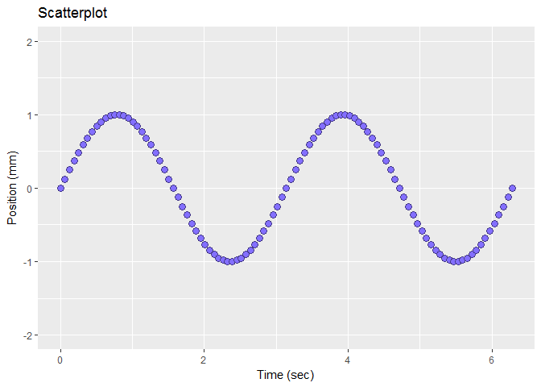

edit the scales
---------------

At this point in the tutorial, we expect you to have a *ggplot()* graph object called *f1* that looks like this:

If not, please return to the earlier tutorials.



Suppose we want the graph to have a 2 mm y-scale with tick marks at 1 mm intervals.

``` r
f1 <- f1 +
    scale_y_continuous(limits = c(-2, 2), breaks = seq(-2, 2, 1))

print(f1)
```


------------------------------------------------------------------------

Self-check quiz

1.  Explain the values assigned to the `limits` argument
2.  Explain the values assigned to the `breaks` argument

Confirm your answers by typing the following in your Console and reading the results in *Help* pane.

-   `?c()`
-   `?scale_y_continuous`

------------------------------------------------------------------------

Next tutorial: [edit theme](tut-0308_edit-theme.md)

------------------------------------------------------------------------

[main page](../README.md)<br> [topics page](README-by-topic.md)
