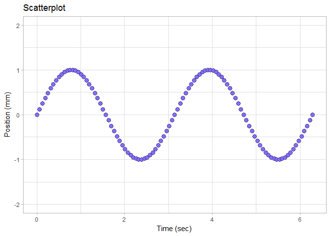
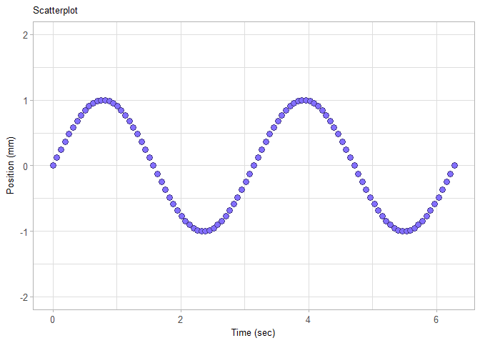

edit the plot theme
-------------------

At this point in the tutorial, we expect you to have a *ggplot()* graph object called *f1* that looks like this:

If not, please return to the earlier tutorials.



The gray background is a *ggplot2* default setting. We can use ggplot2 *themes* to change the background (and every other default setting as well).

In the first example, we'll use one of the set of themes available in the *ggplot2* package.

``` r
f1 <- f1 +
    theme_light()

print(f1)
```


Examples of all the default themes are illustrated at Wickham's [ggplot2 website](http://ggplot2.tidyverse.org/reference/ggtheme.html).

Control the size and font style using the `theme()` function. I use the `rel()` size argument to make all text the same relative size (`0.9`) and type (`"plain"`).

``` r
f1 <- f1 + 
    theme(plot.title = element_text(size = rel(0.9), face = "plain")  
        , axis.title = element_text(size = rel(0.9), face = "plain") 
        , axis.text = element_text(size = rel(0.9), face = "plain")
        )

print(f1)
```



Previous tutorial: [edit the scales](tut-0307_edit-scales.md)<br> Next tutorial: [scatterplot exercise](tut-0309_scatterplot-exercise.md)

------------------------------------------------------------------------

[main page](../README.md)<br> [topics page](README-by-topic.md)
