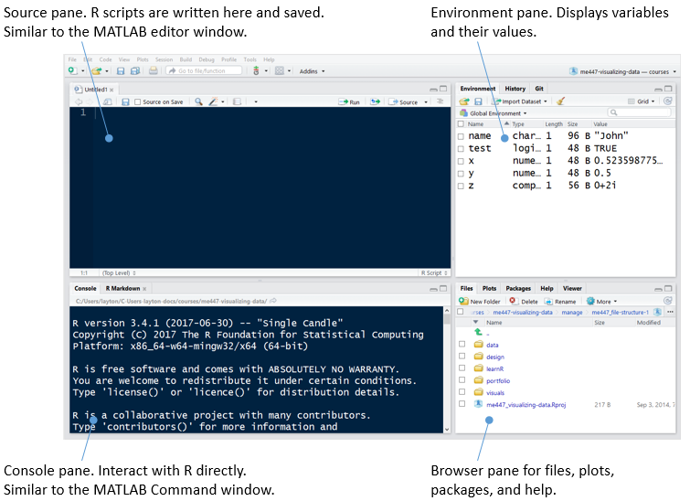
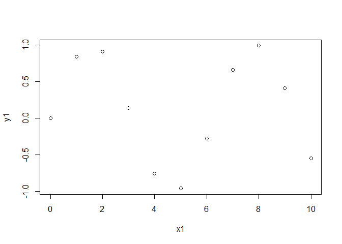

we usually interact with R using scripts
----------------------------------------

Start by opening your RStudio project:<br> File → Recent projects → me447\_visualizing-data.Rproj.

A script is a file of R commands. To start a new R script, use<br> File → New File → R Script.



Save the script in the *practiceR* folder using the filename *tut01\_first-script.R*<br>

File → Save As... → *tut01\_first-script.R*

My suggested file naming for tutorials

-   starts with *tut* indicating a tutorial
-   follows with with *01* indicating chronological order in which the tuitorials are assigned
-   concludes with *first-script* indicating the topic

The open R-script file is shown in the Source pane. This is where we write, edit, and execute R scripts.

Start your script with at least a minimal header, such as

    # tut01_first-script
    # your name
    # date

As you work through the exercises below, add your lines of code to this file.

If you wish to start a program by clearing all variables from the workspace, use `rm()`.

``` r
# clear variables from workspace
rm(list = ls())
```

Execute the file (run the program) by clicking the *Source* button. The Environment pane should now be empty.

In your script, create an array *x*<sub>1</sub> = {1, 2, ..., 10} using the `seq()` function.

``` r
# create an array 0, 1, 2, ..., 10
x1 <- seq(from = 0, to = 10, by = 1)
```

In a function, arguments are assigned values in an `argument = value` format. Using the equal sign in this way is conventional R syntax.

Again, press Source to execute the file. The variable *x*<sub>1</sub> should appear in the Environment pane.

When debugging scripts it is often useful to execute just one line of code at a time.

-   In the script, place your cursor on the line with `rm(list=ls())`.
-   Press the Run button to execute the line.
-   The Environment pane should now be empty.

In the Source pane, the cursor should have advanced to the next line. Press Run again and the variable *x*<sub>1</sub> should reappear.

To summarize our two methods of executing lines of script:

1.  *Run* to execute one line at a time.
2.  *Source* to execute an entire script.

Add to your script *s**i**n*(*x*<sub>1</sub>) assigned to variable *y*<sub>1</sub>.

``` r
# create a second array that is a function of the first
y1 <- sin(x1)
```

Graph it.

``` r
# plot y1 as a function of x1
plot(x1, y1)
```



Click Source and the graph should appear in the Plots pane.

For more information on any of these functions in R, see the links I've provided on the [Getting help](cm/admin-04_getting-help.md) page.

course directory check
----------------------

We added new files to your directory

    me447_visualizing-data
      |- data
      |- design 
      |- portfolio 
      |- practiceR 
      |     `- tut01_first-script.R
      |- visuals
      `- me447_visualizing-data.Rproj

------------------------------------------------------------------------

Next tutorial: [Use Windows Notepad for CSV files](tut-04_notepad-for-csv.md)

------------------------------------------------------------------------

[main page](../README.md)<br> [topics page](README-by-topic.md)
