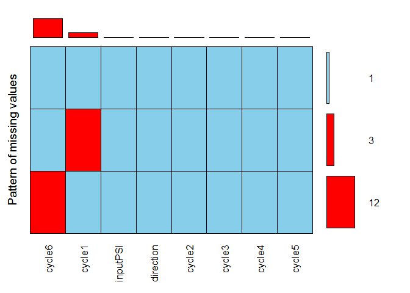

examining a data set
--------------------

Whenever you read a new data set, examine it a number of ways to be certain you know what you have.

In the previous tutorial, we read the CSV files *press-calibr-long.csv* and *press-calibr-long.csv*.

``` r
press_calibr <- read_csv("data/press-calibr-long.csv")
wide_data    <- read_csv("data/press-calibr-wide.csv")
```

Check its class; we usually want a data frame.

``` r
# examine the data frame
class(press_calibr)
## [1] "tbl_df"     "tbl"        "data.frame"
```

It is a data frame (as well as class *tbl* and *tbl\_df* which make for better printing).

Next, from the tidyverse *tibble* package, use the *glimpse()* function to determine the number of variables (columns), the number of observations (rows), the variable names (column names), the variable types (integer, character, double-precision, logical, etc.), and as much data as possible.

``` r
glimpse(press_calibr)
## Observations: 81
## Variables: 5
## $ observN    <int> 1, 2, 3, 4, 5, 6, 7, 8, 9, 10, 11, 12, 13, 14, 15, ...
## $ cycleN     <int> 1, 1, 1, 1, 1, 1, 1, 1, 1, 1, 1, 1, 1, 2, 2, 2, 2, ...
## $ direction  <chr> "up", "up", "up", "up", "up", "dn", "dn", "dn", "dn...
## $ inputPSI   <int> 15, 18, 21, 24, 27, 24, 21, 18, 15, 12, 9, 6, 3, 6,...
## $ readingPSI <dbl> 15.75, 19.00, 23.50, 27.50, 32.50, 29.75, 25.25, 21...
```

Because the data frame is of the *tibble* class, just type its name to print the first 10 rows.

``` r
# print a tibble
press_calibr
## # A tibble: 81 x 5
##    observN cycleN direction inputPSI readingPSI
##      <int>  <int>     <chr>    <int>      <dbl>
##  1       1      1        up       15      15.75
##  2       2      1        up       18      19.00
##  3       3      1        up       21      23.50
##  4       4      1        up       24      27.50
##  5       5      1        up       27      32.50
##  6       6      1        dn       24      29.75
##  7       7      1        dn       21      25.25
##  8       8      1        dn       18      21.50
##  9       9      1        dn       15      18.00
## 10      10      1        dn       12      13.25
## # ... with 71 more rows
```

Otherwise, you can use *head()* to see the first few rows or *tail()* to examine the last few rows (here, n = 10 rows).

``` r
# look at the last 10 rows
tail(press_calibr, n = 10L)
## # A tibble: 10 x 5
##    observN cycleN direction inputPSI readingPSI
##      <int>  <int>     <chr>    <int>      <dbl>
##  1      72      5        dn       18      22.00
##  2      73      5        dn       15      17.75
##  3      74      5        dn       12      13.50
##  4      75      5        dn        9       9.50
##  5      76      5        dn        6       6.75
##  6      77      5        dn        3       2.75
##  7      78      6        up        6       4.25
##  8      79      6        up        9       7.50
##  9      80      6        up       12      11.25
## 10      81      6        up       15      15.25
```

missing values
--------------

In R, missing values are represented by the symbol NA (not available).

The simplest check is *summary()*, then look for any variables with NAs. In this case, the long-form data set has no missing variables, so there are no NAs identified.

``` r
# a data frame with no missing values 
summary(press_calibr)
##     observN       cycleN       direction            inputPSI 
##  Min.   : 1   Min.   :1.000   Length:81          Min.   : 3  
##  1st Qu.:21   1st Qu.:2.000   Class :character   1st Qu.: 9  
##  Median :41   Median :3.000   Mode  :character   Median :15  
##  Mean   :41   Mean   :3.222                      Mean   :15  
##  3rd Qu.:61   3rd Qu.:4.000                      3rd Qu.:21  
##  Max.   :81   Max.   :6.000                      Max.   :27  
##    readingPSI   
##  Min.   : 2.75  
##  1st Qu.: 9.50  
##  Median :15.75  
##  Mean   :16.82  
##  3rd Qu.:23.75  
##  Max.   :33.00
```

Look at the summary of *wide\_data*. The variables *cycle 1* and *cycle 6* have missing values (NA's).

``` r
# data frame that has missing values
summary(wide_data)
##     inputPSI   direction             cycle1          cycle2      
##  Min.   : 3   Length:16          Min.   : 3.00   Min.   : 3.750  
##  1st Qu.: 9   Class :character   1st Qu.:13.25   1st Qu.: 9.438  
##  Median :15   Mode  :character   Median :19.00   Median :16.125  
##  Mean   :15                      Mean   :18.85   Mean   :16.812  
##  3rd Qu.:21                      3rd Qu.:25.25   3rd Qu.:23.750  
##  Max.   :27                      Max.   :32.50   Max.   :32.000  
##                                  NA's   :3                       
##      cycle3           cycle4           cycle5          cycle6      
##  Min.   : 3.750   Min.   : 3.750   Min.   : 2.75   Min.   : 4.250  
##  1st Qu.: 9.562   1st Qu.: 9.188   1st Qu.: 9.00   1st Qu.: 6.688  
##  Median :16.375   Median :16.375   Median :16.62   Median : 9.375  
##  Mean   :17.000   Mean   :16.844   Mean   :16.78   Mean   : 9.562  
##  3rd Qu.:23.750   3rd Qu.:24.125   3rd Qu.:24.19   3rd Qu.:12.250  
##  Max.   :33.000   Max.   :32.750   Max.   :32.25   Max.   :15.250  
##                                                    NA's   :12
```

The *VIM* package has a function *aggr()* (aggregate missing values) that calculates the number of missing values and plots the results. These results show that 12 rows are missing entries in *cycle 6* only, 3 rows are missing data in *cycle 1* only, and 1 row has no missing values.

``` r
# a package for summarizing missing values 
library(VIM)
aggr_plot <- aggr(
    wide_data
    , numbers  = TRUE
    , sortVars = TRUE
    , prop     = FALSE
    , combined = TRUE
    , ylab     = "Pattern of missing values"
    )
```



    ## 
    ##  Variables sorted by number of missings: 
    ##   Variable Count
    ##     cycle6    12
    ##     cycle1     3
    ##   inputPSI     0
    ##  direction     0
    ##     cycle2     0
    ##     cycle3     0
    ##     cycle4     0
    ##     cycle5     0

Below the graph, *aggr()* produces an output that summarizes the numbers shown in the plot.

``` r
unloadNamespace("VIM")
```

Next tutorial: [when a new library masks other functions](tut-0405_new-library-masks.md)

------------------------------------------------------------------------

[main page](../README.md)<br> [topics page](../README-by-topic.md)
