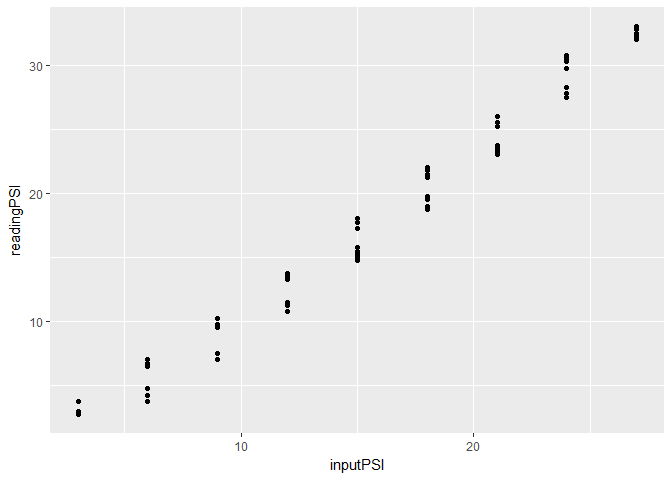
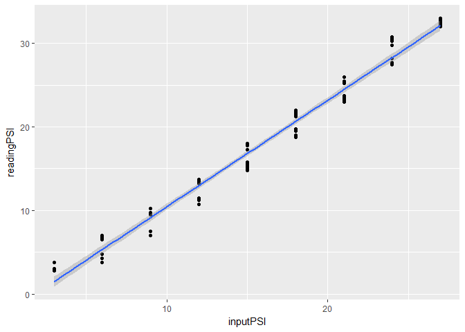
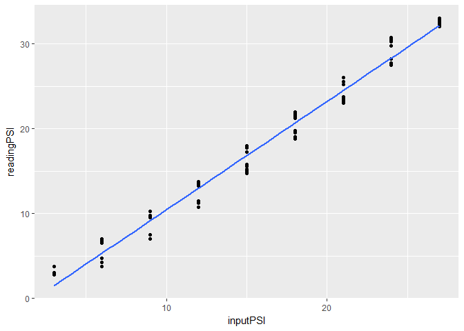

add a regression to a scatterplot
---------------------------------

In the previous tutorial, we saved the pressure calibration data to a CSV file.

``` r
# read a CSV file
press_calibr <- read_csv("data/press-calibr-long.csv")
```

Create a scatterplot with the input pressure in psi on the x-axis and the senosr reading in psi on the y-axis.

``` r
# plot the calibration data in a scatterplot
f1 <- ggplot(data = press_calibr,
        aes(x = inputPSI, y = readingPSI)) +
    geom_point()
print(f1)
```



WE add a regression line (least-squares) by adding the *geom\_smooth(method = lm)* function.

``` r
# add a linear regression
f2 <- f1 + geom_smooth(method = lm)
print(f2)
```



The gray band is the confidence interval. We can moit it using the *se = FALSE* argument.

``` r
# omit the confidence interval
f3 <- f1 +
    geom_smooth(method = lm, se = FALSE)
print(f3)
```



Next tutorial: [accessing data in R](tut-0407_access-data-in-R.md)

------------------------------------------------------------------------

[main page](../README.md)<br> [topics page](../README-by-topic.md)
