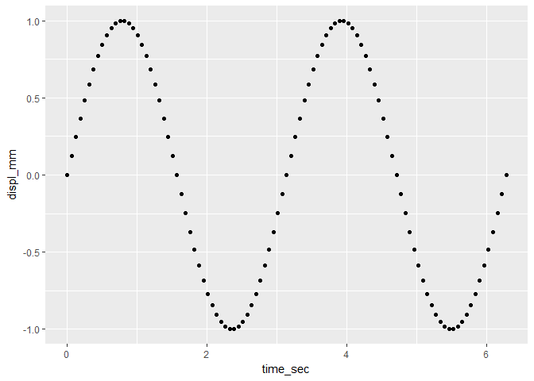
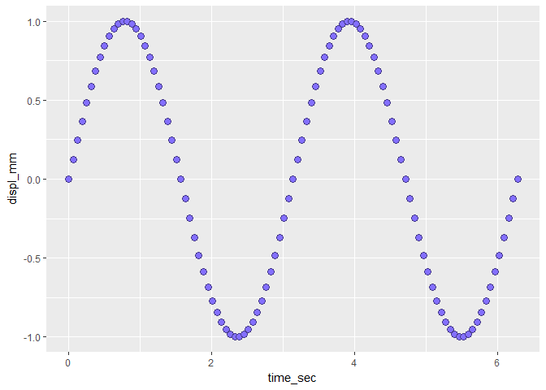
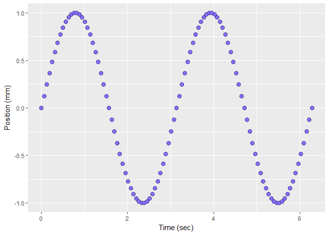
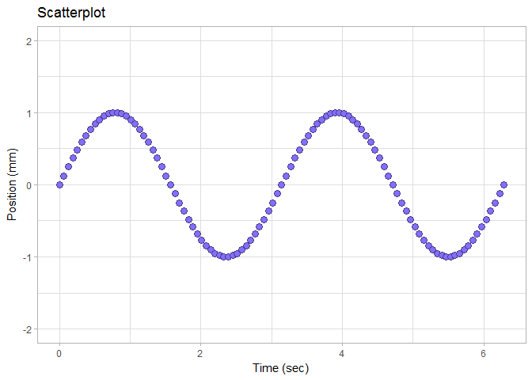

start a script for a scatterplot
--------------------------------

Start every session for our course work by launching your *me447\_visualizing-data.Rproj* file,

*File* → *Open Project* → *me447\_visualizing-data.Rproj*

Using an R Project sets the working directory to your course folder, making relative file paths easy to use.

Start a new R script and save it to your *practiceR* directory.

-   *File* → *New File* → *R Script*
-   *File* → *Save As ...* → *03\_tut\_scatterplot.R*

My suggested file naming

-   starts with *03* indicating the class day (40 total) we did the work
-   followed by *tut* indicating a tutorial
-   concludes with *scatterplot* indicating the topic

Begin the file with a header, something like this.

    #  ------------------------------------------
    #  start learning ggplot2 using a scatterplot
    #
    #  Richard Layton
    #  2017-08-29
    #  ------------------------------------------

Clearing variables from your workspace is optional.

``` r
# if you like to start with an empty workspace 
rm(list = (ls()))
```

Style notes:

-   Place spaces around all operators (`=, +, -, <-, *`, etc.).
-   Comments should explain the why, not the what.
-   See Hadley Wickham's [Advanced R](http://adv-r.had.co.nz/Style.html) for more on R coding style guidelines. (Hadley is "Internet famous" in the R community for creating marvelous packages.)

To run the script after adding a new code chunk,

-   Press the *Source* button (in the upper-right corner of the script pane) to run your script.
-   I recommend you acquire this habit to help you identify and debug problems as they occur.
-   After running a script, the Console pane will show a prompt and a cursor, `> |` indicating that your script executed with no errors.

install and load a package
--------------------------

*Packages* are R modules that you can download and install (like apps for R). Watch this [1-minute video](https://www.youtube.com/watch?v=ljdfqMfWn_A) to learn how to install an R package.

-   Next, install the `ggplot2` package (by Hadley Wickham).

Once a package is installed, you load the package using the `library()` command.

``` r
# to access the functionality of the ggplot2 package 
library(ggplot2)
```

Again, run the script by pressing the *Source* button.

create a data frame
-------------------

To start, we'll create some numerical vectors for plotting.

``` r
# create objects to be assembled in a data frame
time_sec <- seq(0, 2*pi, by = pi/50) # sec
freq     <- 2                        # r/s
displ_mm <- sin(freq * time_sec)     # mm
```

Style notes:

-   Always put a space after a comma, and never before (just like in regular English).
-   Variable and function names should be lowercase. Use an underscore to separate words within a name.
-   Generally, variable names should be nouns and function names should be verbs. Strive for names that are concise and meaningful (this is not easy!)
-   In adjacent lines of code, align the assignment operators `<-` for readability.

------------------------------------------------------------------------

Self-check quiz

1.  Explain the arguments of the `seq()` function.
2.  For each of the three lines of code, identify which objects are scalars and which are vectors.

Confirm your answers by typing the variable name in the Console and viewing the output.

------------------------------------------------------------------------

``` r
# ggplot2 requires data in data frame form
vibr_data <- data.frame(time_sec, displ_mm)
```

Use the `str()` function to examine the structure of `vibr_data`.

``` r
# examine the data frame structure
str(vibr_data)
## 'data.frame':    101 obs. of  2 variables:
##  $ time_sec: num  0 0.0628 0.1257 0.1885 0.2513 ...
##  $ displ_mm: num  0 0.125 0.249 0.368 0.482 ...
```

-   The number of "observations"" is the number of rows.
-   The number of "variables" is the number of columns.
-   The column names and types (`num`) are shown.

To see the first few rows of the data frame, use the `head()` function.

``` r
# control significant digits in printout
options(digits = 3) 

# examine the data frame structure
head(vibr_data)
##   time_sec displ_mm
## 1   0.0000    0.000
## 2   0.0628    0.125
## 3   0.1257    0.249
## 4   0.1885    0.368
## 5   0.2513    0.482
## 6   0.3142    0.588
```

-   The integers are the row numbers of the data frame
-   We'll talk about data frames in more detail soon

create a scatterplot
--------------------

The structure of our *ggplot2* scatterplot begins with identifying the data frame, the columns assigned as *x* and *y* variables, and using *points* as data markers.

``` r
# basic scatterplot
f1 <- ggplot(data = vibr_data, aes(x = time_sec, y = displ_mm)) +
    geom_point()

print(f1)
```



What the commands mean

-   `ggplot()` initializes a ggplot object
-   `data =` assigns the data frame with our data
-   `aes()` describes the "aesthetic mapping" from data to visual properties
-   `geom_point()` draws points on a scatterplot
-   `print()` prints the graph onscreen in the RStudio *Plots* pane.

edit the data markers
---------------------

Change the data marker using the `shape` argument, taking values between 1 and 25 for the [R default plotting symbols](http://www.cookbook-r.com/Graphs/Shapes_and_line_types/). Shapes numbered 21-25 have both `color` (outline) and `fill` color attributes.

In the `geom_point()` function, add the argument `shape = 21`.

``` r
f1 <- ggplot(data = vibr_data, aes(x = time_sec, y = displ_mm)) +
    geom_point(shape = 21)

print(f1)
```


We edit the attributes of the data marker further by adding `color`, `fill`, and `size` arguments to `geom_point()`.

``` r
f1 <- ggplot(data = vibr_data, aes(x = time_sec, y = displ_mm)) +
    geom_point(shape = 21
        , color = "slateblue4"
        , fill  = "slateblue1"
        , size  = 3
        )

print(f1)
```



We'll treat color in much more detail later, but for now, the document [Colors in R](http://www.stat.columbia.edu/~tzheng/files/Rcolor.pdf) shows the default R colors by name.

In the `geom_point()` argument list, I'm using a "line-break before each comma" style. It may look odd at first, but it has a purpose. I can comment-out a single argument line without affecting the rest of the code. I find that this helps with debugging and reusing code plus makes a long list of arguments easier to read.

edit axis labels and title
--------------------------

Label the axes, replacing the default axis labels.

``` r
# add axis labels
f1 <- f1 + 
    xlab("Time (sec)") + 
    ylab("Position (mm)")
print(f1)
```



Add a main title.

``` r
# add a title
f1 <- f1 + 
    ggtitle("Scatterplot")
print(f1)
```


I'm showing you one or two lines of code at a time so you can add the lines, run the script, and see the results one chunk at a time.

In practice, I usually just keep adding lines to the original `ggplot()` function using the plus (+) function, like this.

    # chaining functions together using the plus (+) sign
    f1 <- ggplot(data = vibr_data, aes(x = time_sec, y = displ_mm)) +
        geom_point(shape = 21
            , color = "slateblue4"
            , fill  = "slateblue1"
            , size  = 3
            )
        xlab("Time (sec)") + 
        ylab("Position (mm)") +
        ggtitle("Scatterplot")
        
    print(f1)

edit the scales
---------------

Suppose we want the graph to have a 2 mm y-scale with tick marks at 1 mm intervals.

``` r
f1 <- f1 +
    scale_y_continuous(limits = c(-2, 2), breaks = seq(-2, 2, 1))

print(f1)
```


------------------------------------------------------------------------

Self-check quiz

1.  Explain the values assigned to the `limits` argument
2.  Explain the values assigned to the `breaks` argument

Confirm your answers by typing the following in your Console and reading the results in *Help* pane.

-   `?c()`
-   `?scale_y_continuous`

------------------------------------------------------------------------

edit the plot theme
-------------------

The gray background is a *ggplot2* default setting. We can use ggplot2 *themes* to change the background (and every other default setting as well).

In the first example, we'll use one of the set of themes available in the *ggplot2* package.

``` r
f1 <- f1 +
    theme_light()

print(f1)
```



Examples of all the default themes are illustrated at Wickham's [ggplot2 website](http://ggplot2.tidyverse.org/reference/ggtheme.html).

Control the size and font style using the `theme()` function. I use the `rel()` size argument to make all text the same relative size (`0.9`) and type (`"plain"`).

``` r
f1 <- f1 + 
    theme(plot.title = element_text(size = rel(0.9), face = "plain")  
        , axis.title = element_text(size = rel(0.9), face = "plain") 
        , axis.text = element_text(size = rel(0.9), face = "plain")
        )

print(f1)
```


scatterplot exercise
--------------------

`ggplot2` includes a data frame named `diamonds`. In the console, type `?diamonds` to read a description.

Use the methods presented in this tutorial to answer these questions.

1.  How many diamonds were measured?
2.  How many variables in the data set are numerical?
3.  Create a scatterplot to illustrate the potential dependence of price on carats.
4.  Edit the following to obtain a graph you find satisfactory
    -   data marker size, shape, and color
    -   axis labels and title
    -   theme
    -   axis and title text size and type

What visual problem have we not yet addressed?

------------------------------------------------------------------------

[main page](../README.md)<br> [topics page](README-by-topic.md)
