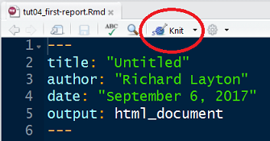
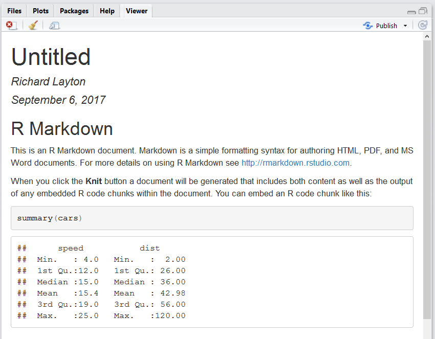

```{r echo=FALSE}
library(knitr)
opts_knit$set(root.dir = "../")
opts_chunk$set(echo = TRUE, message = FALSE, collapse = TRUE, warning = FALSE, cache = TRUE, cache.path = "tut-06-cache/01-", fig.path = "tut-06-images/01-")
```


## preparation

Launch your RStudio project.Start by opening your RStudio project:    
File $\rightarrow$ Recent projects $\rightarrow$ me447_visualizing-data.Rproj.

> ALWAYS start your work session by launching the .Rproj file you created for this course 

Using an R Project sets the working directory to your course folder, making relative file paths easy to use.


## create an R markdown script


From RStudio, create a new R Markdown file:

- *File > New File > R Markdown...*

In the dialog box: 

- Use the default HTML settings for now. 

An untitled R Markdown file is created with some default text and R code. Save the file: 

- *File > Save As...* 
- Save it to your *practiceR* directory
- With the file name *tut04_first-report.Rmd*

To "render" the document, use the *Knit* pulldown menu:

- *Knit > Knit to HTML*

```{r echo=FALSE}

```

The report appears in your RStudio viewer. 

```{r echo=FALSE}

```

The HTML output is convenient when you are drafting a report. We'll switch to Word output later. 


Next tutorial: [edit the R markdown output format](tut-0602_rmd-edit-output.md)

---

[main page](../README.md)<br> 
[topics page](../README-by-topic.md)


