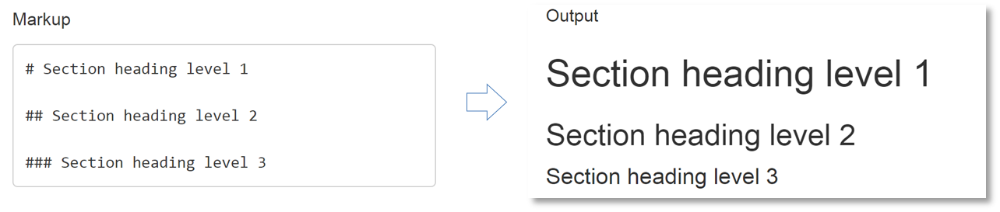
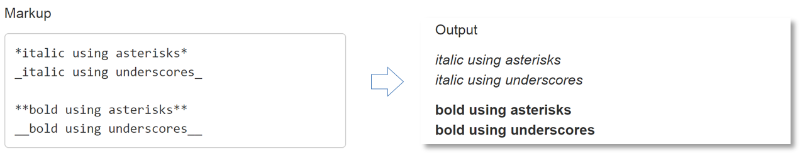
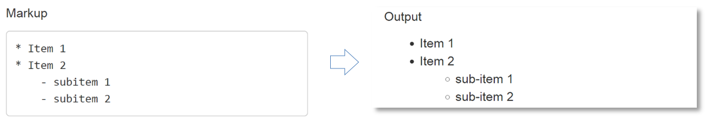
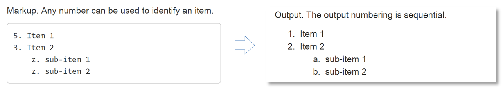

```{r echo=FALSE}
library(knitr)
opts_knit$set(root.dir = "../")
opts_chunk$set(echo = TRUE, message = FALSE, collapse = TRUE, warning = FALSE, cache.path = "tut-06-images")
```


## basic R markdown markup tags 

See the [R Markdown cheat sheet](https://www.rstudio.com/wp-content/uploads/2016/03/rmarkdown-cheatsheet-2.0.pdf) for a more extensive summary of R Markdown. 

#### section headings



#### emphasis



#### itemize 

  
Every line ends with two spaces.   
Sub-items begin with 4 spaces.   



#### enumerate     

Every line ends with two spaces.  
Sub-items begin with 4 spaces.   



#### links

Use a plain URL or add a link to a phrase:

<pre class="markdown"><code>http://example.com

[linked phrase](http://example.com)</code></pre>

#### images


Local files

The relative path for images starts in the directory of the Rmd file, in this case, the *practiceR* directory.  The path states: go up one level "../", down one level "visuals/", and import the image "an_image.png". 

<pre class="markdown"><code>
</code></pre>

Images on the web

<pre class="markdown"><code>
</code></pre>


Next tutorial: [elements of an Rmd report](tut-0604_rmd-elements.md)

---

[main page](../README.md)<br> 
[topics page](../README-by-topic.md)


