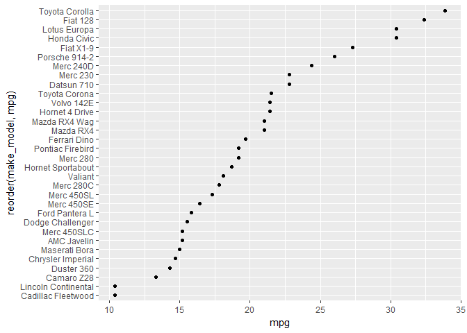
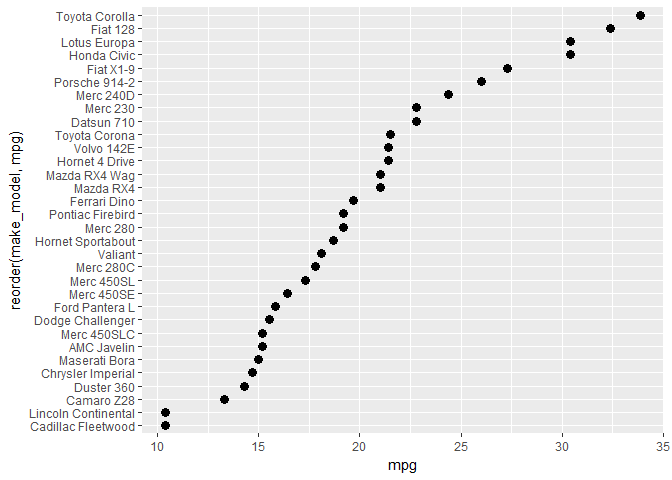
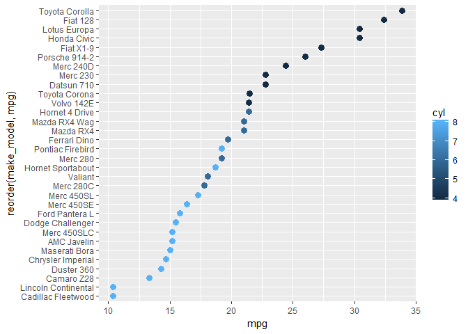
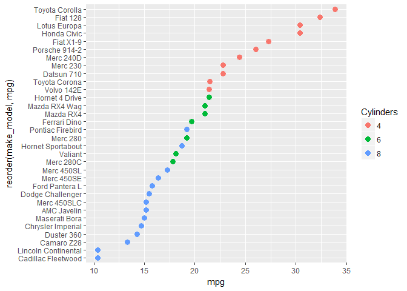
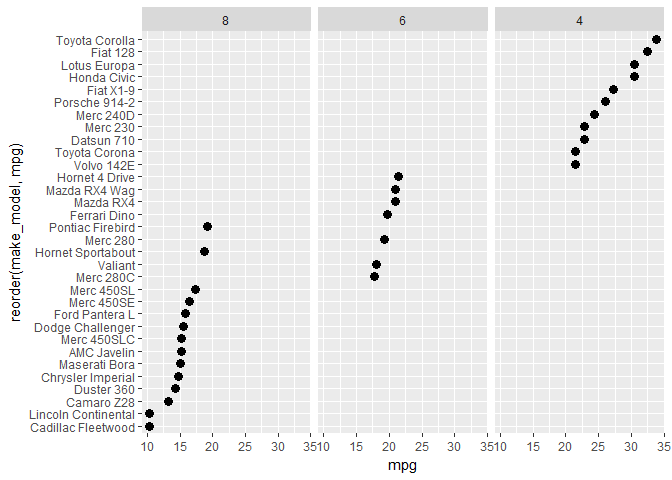
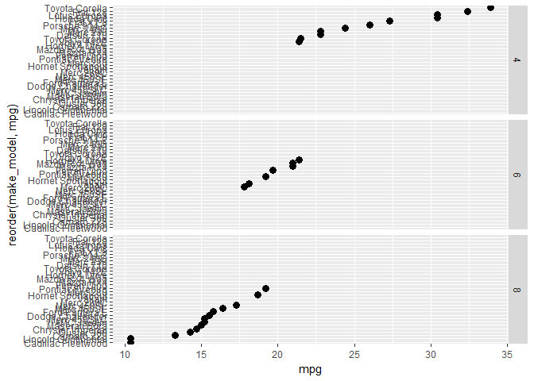
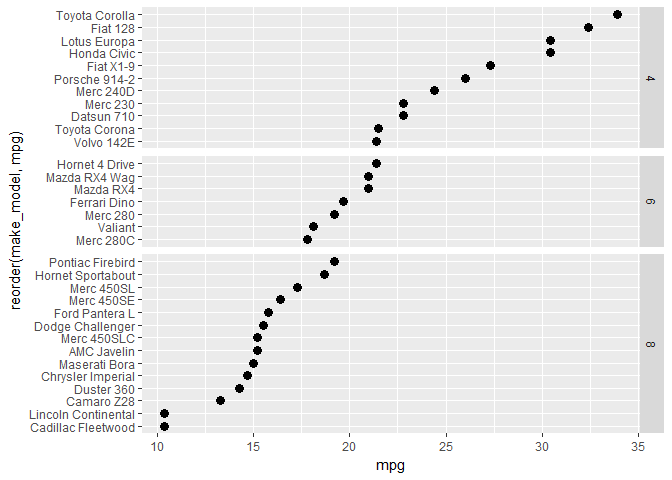
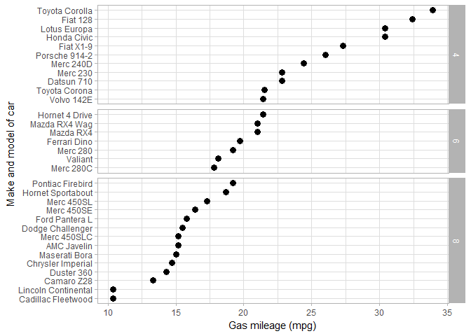
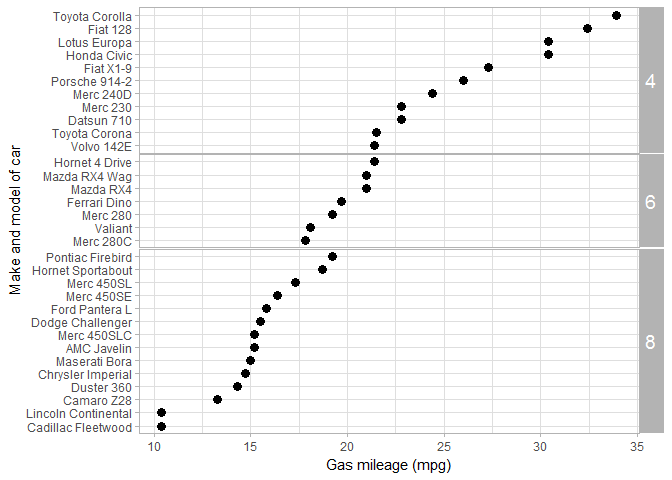

capture data stored in row names
--------------------------------

We'll start with some (nearly) tidy data.

``` r
# dataset in R, 1973–74 models, Motor Trend
data(mtcars)
head(mtcars)
##                    mpg cyl disp  hp drat    wt  qsec vs am gear carb
## Mazda RX4         21.0   6  160 110 3.90 2.620 16.46  0  1    4    4
## Mazda RX4 Wag     21.0   6  160 110 3.90 2.875 17.02  0  1    4    4
## Datsun 710        22.8   4  108  93 3.85 2.320 18.61  1  1    4    1
## Hornet 4 Drive    21.4   6  258 110 3.08 3.215 19.44  1  0    3    1
## Hornet Sportabout 18.7   8  360 175 3.15 3.440 17.02  0  0    3    2
## Valiant           18.1   6  225 105 2.76 3.460 20.22  1  0    3    1
```

This data set has information stored in the row names of the data frame. So, not quite tidy.

The *dplyr* package (for data manipulation) gives us the "pipe" operator `%>%` and *mutate()* that creates a new variable (column) in the data frame.

``` r
# copy the row names to a new variable "make_model" 
library(dplyr)
my_mtcars <- mtcars %>%
    mutate(make_model = row.names(mtcars))
```

Examine the result. You can see that a new variable *make\_model* has been added to the data frame.

``` r
class(my_mtcars)
## [1] "data.frame"

glimpse(my_mtcars)
## Observations: 32
## Variables: 12
## $ mpg        <dbl> 21.0, 21.0, 22.8, 21.4, 18.7, 18.1, 14.3, 24.4, 22....
## $ cyl        <dbl> 6, 6, 4, 6, 8, 6, 8, 4, 4, 6, 6, 8, 8, 8, 8, 8, 8, ...
## $ disp       <dbl> 160.0, 160.0, 108.0, 258.0, 360.0, 225.0, 360.0, 14...
## $ hp         <dbl> 110, 110, 93, 110, 175, 105, 245, 62, 95, 123, 123,...
## $ drat       <dbl> 3.90, 3.90, 3.85, 3.08, 3.15, 2.76, 3.21, 3.69, 3.9...
## $ wt         <dbl> 2.620, 2.875, 2.320, 3.215, 3.440, 3.460, 3.570, 3....
## $ qsec       <dbl> 16.46, 17.02, 18.61, 19.44, 17.02, 20.22, 15.84, 20...
## $ vs         <dbl> 0, 0, 1, 1, 0, 1, 0, 1, 1, 1, 1, 0, 0, 0, 0, 0, 0, ...
## $ am         <dbl> 1, 1, 1, 0, 0, 0, 0, 0, 0, 0, 0, 0, 0, 0, 0, 0, 0, ...
## $ gear       <dbl> 4, 4, 4, 3, 3, 3, 3, 4, 4, 4, 4, 3, 3, 3, 3, 3, 3, ...
## $ carb       <dbl> 4, 4, 1, 1, 2, 1, 4, 2, 2, 4, 4, 3, 3, 3, 4, 4, 4, ...
## $ make_model <chr> "Mazda RX4", "Mazda RX4 Wag", "Datsun 710", "Hornet...
```

create a dot plot
-----------------

The dot plot can be used to replace any data graphic typically drawn as a pie chart or a bar chart. The data structure is typically

-   a continuous quantitative variable (such as mpg) associated with
-   a categorical variable with a number of levels (such as the car make and model)

The data frame *my\_mtcars* was created in the previous tutorial.

Here we graph the car make and model as a function of mileage in mpg.

``` r
# make basic dot plot
library(ggplot2)
f1 <- ggplot(data = my_mtcars, aes(x = mpg, y = make_model)) +
    geom_point()
print(f1)
```


reorder the rows of a dot plot
------------------------------

Apply *reorder()* to the y-variable and indicate the numerical variable used to order the rows.

``` r
# reorder rows
f2 <- ggplot(data = my_mtcars, aes(x = mpg, y = reorder(make_model, mpg))) +
    geom_point()
print(f2)
```



Let's re-size the dots too.

``` r
# dots bigger
f3 <- ggplot(data = my_mtcars, aes(x = mpg, y = reorder(make_model, mpg))) +
    geom_point(size = 3)
print(f3)
```



That's pretty much it for a single-panel, basic dot plot. Next we investigate different ways to use conditioning variables.

condition a dot plot with text
------------------------------

To replace the dot with text, we select a variable in the data frame that has the text we want.

Here, we'll use *cyl*, the variable that has the number of cylinders in the engine of each car.

``` r
# recall that cyl is in the data frame
glimpse(my_mtcars)
## Observations: 32
## Variables: 12
## $ mpg        <dbl> 21.0, 21.0, 22.8, 21.4, 18.7, 18.1, 14.3, 24.4, 22....
## $ cyl        <dbl> 6, 6, 4, 6, 8, 6, 8, 4, 4, 6, 6, 8, 8, 8, 8, 8, 8, ...
## $ disp       <dbl> 160.0, 160.0, 108.0, 258.0, 360.0, 225.0, 360.0, 14...
## $ hp         <dbl> 110, 110, 93, 110, 175, 105, 245, 62, 95, 123, 123,...
## $ drat       <dbl> 3.90, 3.90, 3.85, 3.08, 3.15, 2.76, 3.21, 3.69, 3.9...
## $ wt         <dbl> 2.620, 2.875, 2.320, 3.215, 3.440, 3.460, 3.570, 3....
## $ qsec       <dbl> 16.46, 17.02, 18.61, 19.44, 17.02, 20.22, 15.84, 20...
## $ vs         <dbl> 0, 0, 1, 1, 0, 1, 0, 1, 1, 1, 1, 0, 0, 0, 0, 0, 0, ...
## $ am         <dbl> 1, 1, 1, 0, 0, 0, 0, 0, 0, 0, 0, 0, 0, 0, 0, 0, 0, ...
## $ gear       <dbl> 4, 4, 4, 3, 3, 3, 3, 4, 4, 4, 4, 3, 3, 3, 3, 3, 3, ...
## $ carb       <dbl> 4, 4, 1, 1, 2, 1, 4, 2, 2, 4, 4, 3, 3, 3, 4, 4, 4, ...
## $ make_model <chr> "Mazda RX4", "Mazda RX4 Wag", "Datsun 710", "Hornet...
```

We use *geom\_text* and `label = cyl` in the aesthetics.

``` r
# could use the number of cylinders as the data marker
f4 <- ggplot(data = my_mtcars
    , aes(x = mpg, y = reorder(make_model, mpg), label = cyl)
    ) +
    geom_text()
print(f4)
```


condition a dot plot with color
-------------------------------

We use *geom\_point* and `col = cyl` in the aesthetics.

``` r
# could use dot color
f5 <- ggplot(data = my_mtcars
    , aes(x = mpg, y = reorder(make_model, mpg), col = cyl)
  ) +
    geom_point(size = 3)
print(f5)
```



The legend indicates color-coding used for a continuous variable, but the number of cylinders is actually a discrete value with only 3 levels: 4, 6, and 8.

We use *factor()* to change cylinders from a double-precision variable to a factor and *mutate()* to create the new variable in the data frame.

``` r
# new variable so color can be assigned discrete
my_mtcars <- my_mtcars %>%
    mutate(Cylinders = factor(cyl))
```

We change the color aesthetic to use the new variable, `col = Cylinders`.

``` r
# again with factor
f6 <- ggplot(data = my_mtcars
    , aes(x = mpg, y = reorder(make_model, mpg), col = Cylinders)
    ) +
    geom_point(size = 3)
print(f6)
```



manually change dot plot colors
-------------------------------

Add *scale\_colour\_manual()* to assign colors to *Cylinders*, a factor.

``` r
# change default colors
f7 <- f6 +
    scale_colour_manual(
        values = c("aquamarine4", "darkgoldenrod1", "firebrick")
        )
print(f7)
```


condition a dot plot with facets
--------------------------------

We can group dot plots in panels with *facet\_grid()*. Again, we're using the factor *Cylinders* as the grouping variable.

``` r
# instead of colors, could use panels
f8 <- ggplot(data = my_mtcars, aes(x = mpg, y = reorder(make_model, mpg))) +
    geom_point(size = 3) +
    facet_grid(~ Cylinders)
print(f8)
```


change the order of the facets
------------------------------

We can change the panel order with *reorder()* inside *facet\_grid()*. Here we reorder the panels (*Cylinder* variable) based on the magnitude of the *mpg* variables in each panel.

``` r
# reorder panels
f9 <- f8 +
    facet_grid(~ reorder(Cylinders, mpg))
print(f9)
```



set the y scales free
---------------------

An argument added to *facet\_grid()*.

Because each car has only one mpg, when we used *facet\_grid()*, we end up with empty rows in each panel.

To eliminate the unused rows, first we change panel orientation to vertical.

``` r
# orient vertically
f10 <- f8 +
    facet_grid(Cylinders ~.)
print(f10)
```



Next use `scales = "free_y"` to eliminate all rows with no *mpg* data.

``` r
# free the scales to remove lines with no data
f11 <- f8 +
    facet_grid(Cylinders ~., scales = "free_y")
print(f11)
```


To allow the panel heights to vary such that the row spacing is consistent, add `space = "free_y"` to *facet\_grid()*.

``` r
# make the spacing free too
f12 <- f8 +
    facet_grid(Cylinders ~., scales = "free_y", space = "free_y")
print(f12)
```



rotate text in the panel strip
------------------------------

A `strip.text.y` argument added to the current theme.

``` r
# labels and theme
f13 <- f12 +
    labs(x = "Gas mileage (mpg)", y = "Make and model of car") +
    theme_light()
print(f13)
```



``` r

# edit the strip text
f14 <- f13 +
    theme(strip.text.y = element_text(angle = 0, size = 14))
print(f14)
```


change spacing between panels
-----------------------------

A `panel.spacing` argument added to the current theme.

``` r
# changing panel spacing
f15 <- f14 +
    theme(panel.spacing = unit(0.3, "mm"))
print(f15)
```



Next tutorial: []()

------------------------------------------------------------------------

[main page](../README.md)<br> [topics page](../README-by-topic.md)
