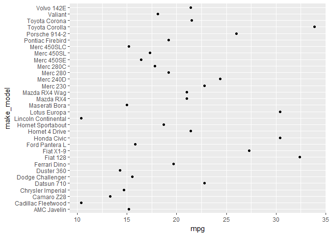

create a dot plot
-----------------

The dot plot can be used to replace any data graphic typically drawn as a pie chart or a bar chart. The data structure is typically

-   a continuous quantitative variable (such as mpg) associated with
-   a categorical variable with a number of levels (such as the car make and model)

The data frame *my\_mtcars* was created in the previous tutorial.

Here we graph the car make and model as a function of mileage in mpg.

``` r
# make basic dot plot
library(ggplot2)
f1 <- ggplot(data = my_mtcars, aes(x = mpg, y = make_model)) +
    geom_point()
print(f1)
```



Next tutorial: [reorder the rows of a dot plot](tut-0703_reorder-rows.md)<br> Tutorial list: [week 2](week-02_assignments.md)

------------------------------------------------------------------------

[main page](../README.md)<br> [topics page](../README-by-topic.md)
