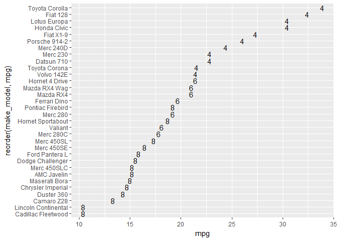

condition a dot plot with text
------------------------------

To replace the dot with text, we select a variable in the data frame that has the text we want.

Here, we'll use *cyl*, the variable that has the number of cylinders in the engine of each car.

``` r
# recall that cyl is in the data frame
glimpse(my_mtcars)
## Observations: 32
## Variables: 12
## $ mpg        <dbl> 21.0, 21.0, 22.8, 21.4, 18.7, 18.1, 14.3, 24.4, 22....
## $ cyl        <dbl> 6, 6, 4, 6, 8, 6, 8, 4, 4, 6, 6, 8, 8, 8, 8, 8, 8, ...
## $ disp       <dbl> 160.0, 160.0, 108.0, 258.0, 360.0, 225.0, 360.0, 14...
## $ hp         <dbl> 110, 110, 93, 110, 175, 105, 245, 62, 95, 123, 123,...
## $ drat       <dbl> 3.90, 3.90, 3.85, 3.08, 3.15, 2.76, 3.21, 3.69, 3.9...
## $ wt         <dbl> 2.620, 2.875, 2.320, 3.215, 3.440, 3.460, 3.570, 3....
## $ qsec       <dbl> 16.46, 17.02, 18.61, 19.44, 17.02, 20.22, 15.84, 20...
## $ vs         <dbl> 0, 0, 1, 1, 0, 1, 0, 1, 1, 1, 1, 0, 0, 0, 0, 0, 0, ...
## $ am         <dbl> 1, 1, 1, 0, 0, 0, 0, 0, 0, 0, 0, 0, 0, 0, 0, 0, 0, ...
## $ gear       <dbl> 4, 4, 4, 3, 3, 3, 3, 4, 4, 4, 4, 3, 3, 3, 3, 3, 3, ...
## $ carb       <dbl> 4, 4, 1, 1, 2, 1, 4, 2, 2, 4, 4, 3, 3, 3, 4, 4, 4, ...
## $ make_model <chr> "Mazda RX4", "Mazda RX4 Wag", "Datsun 710", "Hornet...
```

We use *geom\_text* and `label = cyl` in the aesthetics.

``` r
# could use the number of cylinders as the data marker
f4 <- ggplot(data = my_mtcars
    , aes(x = mpg, y = reorder(make_model, mpg), label = cyl)
    ) +
    geom_text()
print(f4)
```



Next tutorial: [condition a dot plot with color](tut-0705_condition-by-color.md)<br> Tutorial list: [week 2](week-02_assignments.md)

------------------------------------------------------------------------

[main page](../README.md)<br> [topics page](../README-by-topic.md)
