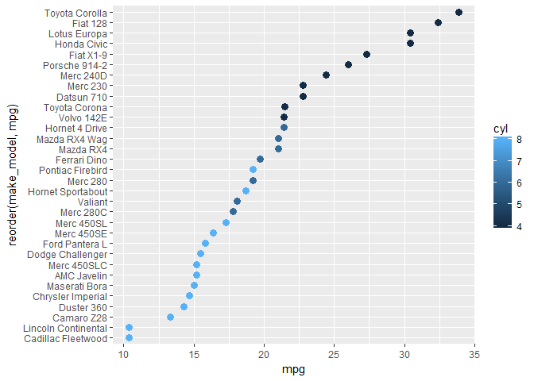

condition a dot plot with color
-------------------------------

We use *geom\_point* and `col = cyl` in the aesthetics.

``` r
# could use dot color
f5 <- ggplot(data = my_mtcars
    , aes(x = mpg, y = reorder(make_model, mpg), col = cyl)
  ) +
    geom_point(size = 3)
print(f5)
```



The legend indicates color-coding used for a continuous variable, but the number of cylinders is actually a discrete value with only 3 levels: 4, 6, and 8.

We use *factor()* to change cylinders from a double-precision variable to a factor and *mutate()* to create the new variable in the data frame.

``` r
# new variable so color can be assigned discrete
my_mtcars <- my_mtcars %>%
    mutate(Cylinders = factor(cyl))
```

We change the color aesthetic to use the new variable, `col = Cylinders`.

``` r
# again with factor
f6 <- ggplot(data = my_mtcars
    , aes(x = mpg, y = reorder(make_model, mpg), col = Cylinders)
    ) +
    geom_point(size = 3)
print(f6)
```


Next tutorial: [manually change dot plot colors](tut-0706_manual-color.md)<br> Tutorial list: [week 2](week-02_assignments.md)

------------------------------------------------------------------------

[main page](../README.md)<br> [topics page](../README-by-topic.md)
