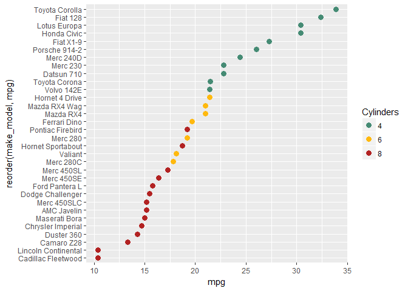

manually change dot plot colors
-------------------------------

Add *scale\_colour\_manual()* to assign colors to *Cylinders*, a factor.

``` r
# change default colors
f7 <- f6 +
    scale_colour_manual(
        values = c("aquamarine4", "darkgoldenrod1", "firebrick")
        )
print(f7)
```



Next tutorial: [condition a dot plot with facets](tut-0707_condition-facets.md)<br> Tutorial list: [week 2](week-02_assignments.md)

------------------------------------------------------------------------

[main page](../README.md)<br> [topics page](../README-by-topic.md)
