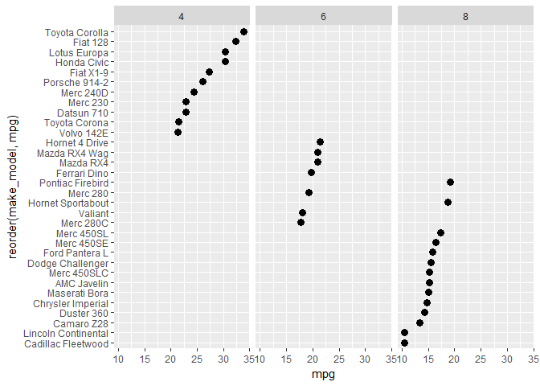

condition a dot plot with facets
--------------------------------

We can group dot plots in panels with *facet\_grid()*. Again, we're using the factor *Cylinders* as the grouping variable.

``` r
# instead of colors, could use panels
f8 <- ggplot(data = my_mtcars, aes(x = mpg, y = reorder(make_model, mpg))) +
    geom_point(size = 3) +
    facet_grid(~ Cylinders)
print(f8)
```



Next tutorial: [change the order of the facets](tut-0708_order-facets.md)<br> Tutorial list: [week 2](week-02_assignments.md)

------------------------------------------------------------------------

[main page](../README.md)<br> [topics page](../README-by-topic.md)
