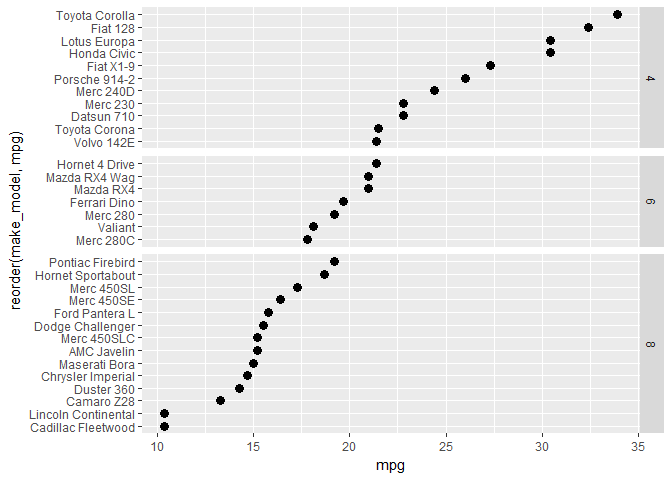

set the y scales free
---------------------

An argument added to *facet\_grid()*.

Because each car has only one mpg, when we used *facet\_grid()*, we end up with empty rows in each panel.

To eliminate the unused rows, first we change panel orientation to vertical.

``` r
# orient vertically
f10 <- f8 +
    facet_grid(Cylinders ~.)
print(f10)
```


Next use `scales = "free_y"` to eliminate all rows with no *mpg* data.

``` r
# free the scales to remove lines with no data
f11 <- f8 +
    facet_grid(Cylinders ~., scales = "free_y")
print(f11)
```


To allow the panel heights to vary such that the row spacing is consistent, add `space = "free_y"` to *facet\_grid()*.

``` r
# make the spacing free too
f12 <- f8 +
    facet_grid(Cylinders ~., scales = "free_y", space = "free_y")
print(f12)
```



Next tutorial: [rotate text in the panel strip](tut-0710_rotate-strip-text.md)<br> Tutorial list: [week 2](week-02_assignments.md)

------------------------------------------------------------------------

[main page](../README.md)<br> [topics page](../README-by-topic.md)
