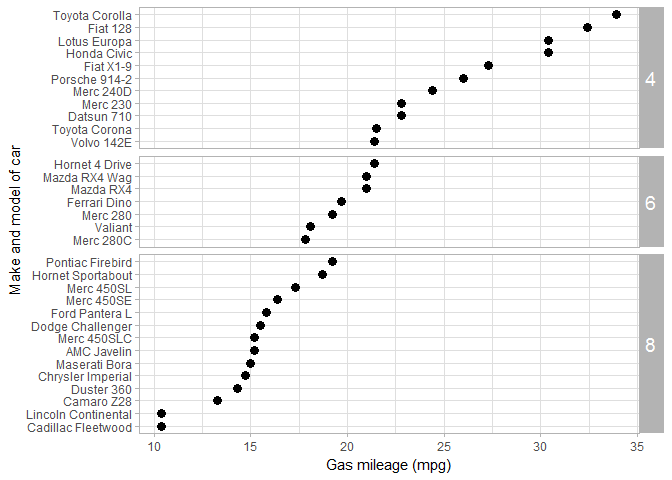

rotate text in the panel strip
------------------------------

A `strip.text.y` argument added to the current theme.

``` r
# labels and theme
f13 <- f12 +
    labs(x = "Gas mileage (mpg)", y = "Make and model of car") +
    theme_light()
print(f13)
```


``` r

# edit the strip text
f14 <- f13 +
    theme(strip.text.y = element_text(angle = 0, size = 14))
print(f14)
```



Next tutorial: [change spacing between panels](tut-0711_change-panel-spacing.md)<br> Tutorial list: [week 2](week-02_assignments.md)

------------------------------------------------------------------------

[main page](../README.md)<br> [topics page](../README-by-topic.md)
