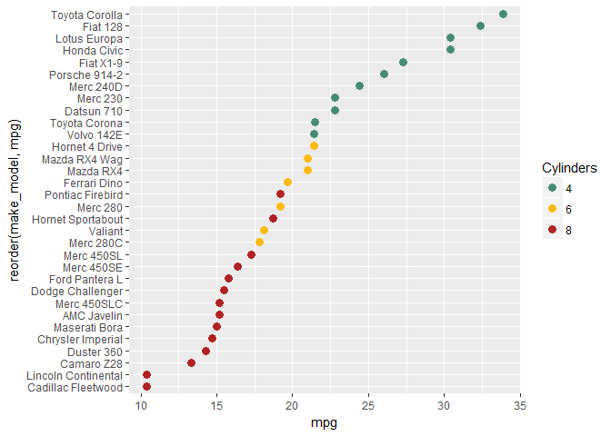

change spacing between panels
-----------------------------

A `panel.spacing` argument added to the current theme.

``` r
# changing panel spacing
f15 <- f14 +
    theme(panel.spacing = unit(0.3, "mm"))
print(f15)
```



Next tutorial: [dot plot exercises](tut-0712_dotplot-exercises.md)<br> Tutorial list: [week 2](week-02_assignments.md)

------------------------------------------------------------------------

[main page](../README.md)<br> [topics page](../README-by-topic.md)
