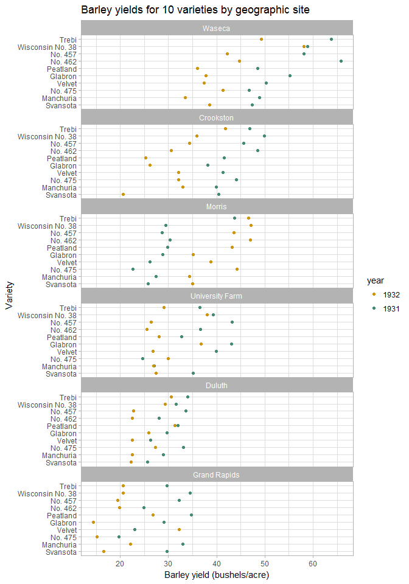

dot plot exercises
------------------

We're going to use the well-known *barley* dataset which is in the *lattice* package.

-   Install and load the *lattice* package.
-   Bring the data into your workspace using `data(barley, package = "lattice")`.

1.  How many observations in the data? How many variables? What type of variables are they?
2.  Plot a dot plot with variety as a function of yield.
3.  Condition the data by site.
4.  Orient the facets into a single column.
5.  Reorder the rows.
6.  Reorder the facets.
7.  Change the color of the dots.
8.  Edit the appearance to make the graph presentable.

My solution is shown below.

Tutorial list: [week 2](week-02_assignments.md)

------------------------------------------------------------------------

[main page](../README.md)  [topics page](../README-by-topic.md)
