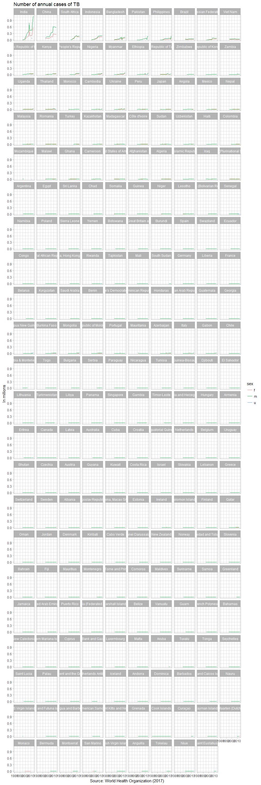
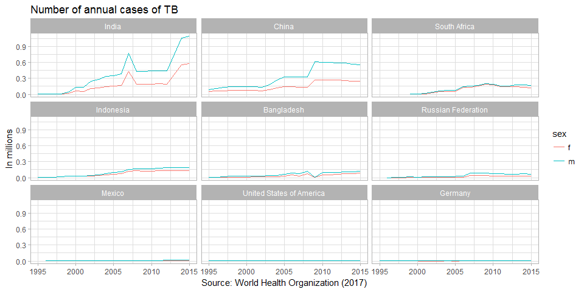

tidying data case study
-----------------------

Preparation

-   Start a new script in your *practiceR* directory called *tut06\_tidying-data-02\_who-TB.R*
-   Start with your usual header

        #  ---------------------------------------  
        #  tidying data
        #  world health organization 2016 TB data
        #  
        #  name  
        #  date  
        #  ---------------------------------------  

-   Remember to install any packages you haven't used before

``` r
library(stringr)   # for str_replace()
library(tidyverse) # includes
## Loading tidyverse: ggplot2
## Loading tidyverse: tibble
## Loading tidyverse: tidyr
## Loading tidyverse: readr
## Loading tidyverse: purrr
## Loading tidyverse: dplyr
## Conflicts with tidy packages ----------------------------------------------
## filter(): dplyr, stats
## lag():    dplyr, stats
#   # dplyr:  %>%, select(), mutate(), filter()
#   # tibble: rownames_to_column()
#   # tidyr:: gather(), spread()
#   # readr:  read_csv()
```

source
------

I adapted this study from [Data Tidying](http://garrettgman.github.io/tidying/), a chapter from the book [R for Data Science](http://shop.oreilly.com/product/0636920034407.do) by Hadley Wickham and Garrett Grolemund.

I'm following much of their work but have updated the dataset to use the 2016 [Case notifications](http://www.who.int/tb/country/data/download/en/) data from the World Health Organization.

I downloaded the file called from the WHO website and saved it to our course GitHub data file.

-   Download the *TB\_notifications\_2017-09-10.csv* file from GitHub and save it to your course *data* directory.

first look
----------

``` r
# read the CSV file 
tb_data <- read_csv("data/TB_notifications_2017-09-10.csv")
## Parsed with column specification:
## cols(
##   .default = col_integer(),
##   country = col_character(),
##   iso2 = col_character(),
##   iso3 = col_character(),
##   g_whoregion = col_character(),
##   new_sn_sexunk04 = col_character(),
##   new_sn_sexunk514 = col_character(),
##   new_sn_sexunk014 = col_character(),
##   new_sn_sexunk15plus = col_character(),
##   new_ep_m04 = col_character(),
##   new_ep_sexunkageunk = col_character(),
##   newrel_sexunk04 = col_character(),
##   newrel_sexunk514 = col_character(),
##   newrel_sexunk014 = col_character(),
##   newrel_sexunk15plus = col_character(),
##   newrel_sexunkageunk = col_character(),
##   rdxsurvey_newinc = col_character(),
##   rdxsurvey_newinc_rdx = col_character()
## )
## See spec(...) for full column specifications.
```

From *glimpse()* below we see we have 7674 observations of 174 variables.

``` r
glimpse(tb_data)
## Observations: 7,674
## Variables: 174
## $ country               <chr> "Afghanistan", "Afghanistan", "Afghanist...
## $ iso2                  <chr> "AF", "AF", "AF", "AF", "AF", "AF", "AF"...
## $ iso3                  <chr> "AFG", "AFG", "AFG", "AFG", "AFG", "AFG"...
## $ iso_numeric           <int> 4, 4, 4, 4, 4, 4, 4, 4, 4, 4, 4, 4, 4, 4...
## $ g_whoregion           <chr> "EMR", "EMR", "EMR", "EMR", "EMR", "EMR"...
## $ year                  <int> 1980, 1981, 1982, 1983, 1984, 1985, 1986...
## $ new_sp                <int> NA, NA, NA, NA, NA, NA, NA, NA, NA, NA, ...
## $ new_sn                <int> NA, NA, NA, NA, NA, NA, NA, NA, NA, NA, ...
## $ new_su                <int> NA, NA, NA, NA, NA, NA, NA, NA, NA, NA, ...
## $ new_ep                <int> NA, NA, NA, NA, NA, NA, NA, NA, NA, NA, ...
## $ new_oth               <int> NA, NA, NA, NA, NA, NA, NA, NA, NA, NA, ...
## $ ret_rel               <int> NA, NA, NA, NA, NA, NA, NA, NA, NA, NA, ...
## $ ret_taf               <int> NA, NA, NA, NA, NA, NA, NA, NA, NA, NA, ...
## $ ret_tad               <int> NA, NA, NA, NA, NA, NA, NA, NA, NA, NA, ...
## $ ret_oth               <int> NA, NA, NA, NA, NA, NA, NA, NA, NA, NA, ...
## $ newret_oth            <int> NA, NA, NA, NA, NA, NA, NA, NA, NA, NA, ...
## $ new_labconf           <int> NA, NA, NA, NA, NA, NA, NA, NA, NA, NA, ...
## $ new_clindx            <int> NA, NA, NA, NA, NA, NA, NA, NA, NA, NA, ...
## $ ret_rel_labconf       <int> NA, NA, NA, NA, NA, NA, NA, NA, NA, NA, ...
## $ ret_rel_clindx        <int> NA, NA, NA, NA, NA, NA, NA, NA, NA, NA, ...
## $ ret_rel_ep            <int> NA, NA, NA, NA, NA, NA, NA, NA, NA, NA, ...
## $ ret_nrel              <int> NA, NA, NA, NA, NA, NA, NA, NA, NA, NA, ...
## $ notif_foreign         <int> NA, NA, NA, NA, NA, NA, NA, NA, NA, NA, ...
## $ c_newinc              <int> 71685, 71554, 41752, 52502, 18784, 10742...
## $ new_sp_m04            <int> NA, NA, NA, NA, NA, NA, NA, NA, NA, NA, ...
## $ new_sp_m514           <int> NA, NA, NA, NA, NA, NA, NA, NA, NA, NA, ...
## $ new_sp_m014           <int> NA, NA, NA, NA, NA, NA, NA, NA, NA, NA, ...
## $ new_sp_m1524          <int> NA, NA, NA, NA, NA, NA, NA, NA, NA, NA, ...
## $ new_sp_m2534          <int> NA, NA, NA, NA, NA, NA, NA, NA, NA, NA, ...
## $ new_sp_m3544          <int> NA, NA, NA, NA, NA, NA, NA, NA, NA, NA, ...
## $ new_sp_m4554          <int> NA, NA, NA, NA, NA, NA, NA, NA, NA, NA, ...
## $ new_sp_m5564          <int> NA, NA, NA, NA, NA, NA, NA, NA, NA, NA, ...
## $ new_sp_m65            <int> NA, NA, NA, NA, NA, NA, NA, NA, NA, NA, ...
## $ new_sp_mu             <int> NA, NA, NA, NA, NA, NA, NA, NA, NA, NA, ...
## $ new_sp_f04            <int> NA, NA, NA, NA, NA, NA, NA, NA, NA, NA, ...
## $ new_sp_f514           <int> NA, NA, NA, NA, NA, NA, NA, NA, NA, NA, ...
## $ new_sp_f014           <int> NA, NA, NA, NA, NA, NA, NA, NA, NA, NA, ...
## $ new_sp_f1524          <int> NA, NA, NA, NA, NA, NA, NA, NA, NA, NA, ...
## $ new_sp_f2534          <int> NA, NA, NA, NA, NA, NA, NA, NA, NA, NA, ...
## $ new_sp_f3544          <int> NA, NA, NA, NA, NA, NA, NA, NA, NA, NA, ...
## $ new_sp_f4554          <int> NA, NA, NA, NA, NA, NA, NA, NA, NA, NA, ...
## $ new_sp_f5564          <int> NA, NA, NA, NA, NA, NA, NA, NA, NA, NA, ...
## $ new_sp_f65            <int> NA, NA, NA, NA, NA, NA, NA, NA, NA, NA, ...
## $ new_sp_fu             <int> NA, NA, NA, NA, NA, NA, NA, NA, NA, NA, ...
## $ new_sn_m04            <int> NA, NA, NA, NA, NA, NA, NA, NA, NA, NA, ...
## $ new_sn_m514           <int> NA, NA, NA, NA, NA, NA, NA, NA, NA, NA, ...
## $ new_sn_m014           <int> NA, NA, NA, NA, NA, NA, NA, NA, NA, NA, ...
## $ new_sn_m1524          <int> NA, NA, NA, NA, NA, NA, NA, NA, NA, NA, ...
## $ new_sn_m2534          <int> NA, NA, NA, NA, NA, NA, NA, NA, NA, NA, ...
## $ new_sn_m3544          <int> NA, NA, NA, NA, NA, NA, NA, NA, NA, NA, ...
## $ new_sn_m4554          <int> NA, NA, NA, NA, NA, NA, NA, NA, NA, NA, ...
## $ new_sn_m5564          <int> NA, NA, NA, NA, NA, NA, NA, NA, NA, NA, ...
## $ new_sn_m65            <int> NA, NA, NA, NA, NA, NA, NA, NA, NA, NA, ...
## $ new_sn_m15plus        <int> NA, NA, NA, NA, NA, NA, NA, NA, NA, NA, ...
## $ new_sn_mu             <int> NA, NA, NA, NA, NA, NA, NA, NA, NA, NA, ...
## $ new_sn_f04            <int> NA, NA, NA, NA, NA, NA, NA, NA, NA, NA, ...
## $ new_sn_f514           <int> NA, NA, NA, NA, NA, NA, NA, NA, NA, NA, ...
## $ new_sn_f014           <int> NA, NA, NA, NA, NA, NA, NA, NA, NA, NA, ...
## $ new_sn_f1524          <int> NA, NA, NA, NA, NA, NA, NA, NA, NA, NA, ...
## $ new_sn_f2534          <int> NA, NA, NA, NA, NA, NA, NA, NA, NA, NA, ...
## $ new_sn_f3544          <int> NA, NA, NA, NA, NA, NA, NA, NA, NA, NA, ...
## $ new_sn_f4554          <int> NA, NA, NA, NA, NA, NA, NA, NA, NA, NA, ...
## $ new_sn_f5564          <int> NA, NA, NA, NA, NA, NA, NA, NA, NA, NA, ...
## $ new_sn_f65            <int> NA, NA, NA, NA, NA, NA, NA, NA, NA, NA, ...
## $ new_sn_f15plus        <int> NA, NA, NA, NA, NA, NA, NA, NA, NA, NA, ...
## $ new_sn_fu             <int> NA, NA, NA, NA, NA, NA, NA, NA, NA, NA, ...
## $ new_sn_sexunk04       <chr> NA, NA, NA, NA, NA, NA, NA, NA, NA, NA, ...
## $ new_sn_sexunk514      <chr> NA, NA, NA, NA, NA, NA, NA, NA, NA, NA, ...
## $ new_sn_sexunk014      <chr> NA, NA, NA, NA, NA, NA, NA, NA, NA, NA, ...
## $ new_sn_sexunk15plus   <chr> NA, NA, NA, NA, NA, NA, NA, NA, NA, NA, ...
## $ new_ep_m04            <chr> NA, NA, NA, NA, NA, NA, NA, NA, NA, NA, ...
## $ new_ep_m514           <int> NA, NA, NA, NA, NA, NA, NA, NA, NA, NA, ...
## $ new_ep_m014           <int> NA, NA, NA, NA, NA, NA, NA, NA, NA, NA, ...
## $ new_ep_m1524          <int> NA, NA, NA, NA, NA, NA, NA, NA, NA, NA, ...
## $ new_ep_m2534          <int> NA, NA, NA, NA, NA, NA, NA, NA, NA, NA, ...
## $ new_ep_m3544          <int> NA, NA, NA, NA, NA, NA, NA, NA, NA, NA, ...
## $ new_ep_m4554          <int> NA, NA, NA, NA, NA, NA, NA, NA, NA, NA, ...
## $ new_ep_m5564          <int> NA, NA, NA, NA, NA, NA, NA, NA, NA, NA, ...
## $ new_ep_m65            <int> NA, NA, NA, NA, NA, NA, NA, NA, NA, NA, ...
## $ new_ep_m15plus        <int> NA, NA, NA, NA, NA, NA, NA, NA, NA, NA, ...
## $ new_ep_mu             <int> NA, NA, NA, NA, NA, NA, NA, NA, NA, NA, ...
## $ new_ep_f04            <int> NA, NA, NA, NA, NA, NA, NA, NA, NA, NA, ...
## $ new_ep_f514           <int> NA, NA, NA, NA, NA, NA, NA, NA, NA, NA, ...
## $ new_ep_f014           <int> NA, NA, NA, NA, NA, NA, NA, NA, NA, NA, ...
## $ new_ep_f1524          <int> NA, NA, NA, NA, NA, NA, NA, NA, NA, NA, ...
## $ new_ep_f2534          <int> NA, NA, NA, NA, NA, NA, NA, NA, NA, NA, ...
## $ new_ep_f3544          <int> NA, NA, NA, NA, NA, NA, NA, NA, NA, NA, ...
## $ new_ep_f4554          <int> NA, NA, NA, NA, NA, NA, NA, NA, NA, NA, ...
## $ new_ep_f5564          <int> NA, NA, NA, NA, NA, NA, NA, NA, NA, NA, ...
## $ new_ep_f65            <int> NA, NA, NA, NA, NA, NA, NA, NA, NA, NA, ...
## $ new_ep_f15plus        <int> NA, NA, NA, NA, NA, NA, NA, NA, NA, NA, ...
## $ new_ep_fu             <int> NA, NA, NA, NA, NA, NA, NA, NA, NA, NA, ...
## $ new_ep_sexunk04       <int> NA, NA, NA, NA, NA, NA, NA, NA, NA, NA, ...
## $ new_ep_sexunk514      <int> NA, NA, NA, NA, NA, NA, NA, NA, NA, NA, ...
## $ new_ep_sexunk014      <int> NA, NA, NA, NA, NA, NA, NA, NA, NA, NA, ...
## $ new_ep_sexunk15plus   <int> NA, NA, NA, NA, NA, NA, NA, NA, NA, NA, ...
## $ new_ep_sexunkageunk   <chr> NA, NA, NA, NA, NA, NA, NA, NA, NA, NA, ...
## $ rel_in_agesex_flg     <int> NA, NA, NA, NA, NA, NA, NA, NA, NA, NA, ...
## $ newrel_m04            <int> NA, NA, NA, NA, NA, NA, NA, NA, NA, NA, ...
## $ newrel_m514           <int> NA, NA, NA, NA, NA, NA, NA, NA, NA, NA, ...
## $ newrel_m014           <int> NA, NA, NA, NA, NA, NA, NA, NA, NA, NA, ...
## $ newrel_m1524          <int> NA, NA, NA, NA, NA, NA, NA, NA, NA, NA, ...
## $ newrel_m2534          <int> NA, NA, NA, NA, NA, NA, NA, NA, NA, NA, ...
## $ newrel_m3544          <int> NA, NA, NA, NA, NA, NA, NA, NA, NA, NA, ...
## $ newrel_m4554          <int> NA, NA, NA, NA, NA, NA, NA, NA, NA, NA, ...
## $ newrel_m5564          <int> NA, NA, NA, NA, NA, NA, NA, NA, NA, NA, ...
## $ newrel_m65            <int> NA, NA, NA, NA, NA, NA, NA, NA, NA, NA, ...
## $ newrel_m15plus        <int> NA, NA, NA, NA, NA, NA, NA, NA, NA, NA, ...
## $ newrel_mu             <int> NA, NA, NA, NA, NA, NA, NA, NA, NA, NA, ...
## $ newrel_f04            <int> NA, NA, NA, NA, NA, NA, NA, NA, NA, NA, ...
## $ newrel_f514           <int> NA, NA, NA, NA, NA, NA, NA, NA, NA, NA, ...
## $ newrel_f014           <int> NA, NA, NA, NA, NA, NA, NA, NA, NA, NA, ...
## $ newrel_f1524          <int> NA, NA, NA, NA, NA, NA, NA, NA, NA, NA, ...
## $ newrel_f2534          <int> NA, NA, NA, NA, NA, NA, NA, NA, NA, NA, ...
## $ newrel_f3544          <int> NA, NA, NA, NA, NA, NA, NA, NA, NA, NA, ...
## $ newrel_f4554          <int> NA, NA, NA, NA, NA, NA, NA, NA, NA, NA, ...
## $ newrel_f5564          <int> NA, NA, NA, NA, NA, NA, NA, NA, NA, NA, ...
## $ newrel_f65            <int> NA, NA, NA, NA, NA, NA, NA, NA, NA, NA, ...
## $ newrel_f15plus        <int> NA, NA, NA, NA, NA, NA, NA, NA, NA, NA, ...
## $ newrel_fu             <int> NA, NA, NA, NA, NA, NA, NA, NA, NA, NA, ...
## $ newrel_sexunk04       <chr> NA, NA, NA, NA, NA, NA, NA, NA, NA, NA, ...
## $ newrel_sexunk514      <chr> NA, NA, NA, NA, NA, NA, NA, NA, NA, NA, ...
## $ newrel_sexunk014      <chr> NA, NA, NA, NA, NA, NA, NA, NA, NA, NA, ...
## $ newrel_sexunk15plus   <chr> NA, NA, NA, NA, NA, NA, NA, NA, NA, NA, ...
## $ newrel_sexunkageunk   <chr> NA, NA, NA, NA, NA, NA, NA, NA, NA, NA, ...
## $ rdx_data_available    <int> NA, NA, NA, NA, NA, NA, NA, NA, NA, NA, ...
## $ newinc_rdx            <int> NA, NA, NA, NA, NA, NA, NA, NA, NA, NA, ...
## $ rdxsurvey_newinc      <chr> NA, NA, NA, NA, NA, NA, NA, NA, NA, NA, ...
## $ rdxsurvey_newinc_rdx  <chr> NA, NA, NA, NA, NA, NA, NA, NA, NA, NA, ...
## $ rdst_new              <int> NA, NA, NA, NA, NA, NA, NA, NA, NA, NA, ...
## $ rdst_ret              <int> NA, NA, NA, NA, NA, NA, NA, NA, NA, NA, ...
## $ rdst_unk              <int> NA, NA, NA, NA, NA, NA, NA, NA, NA, NA, ...
## $ conf_rrmdr            <int> NA, NA, NA, NA, NA, NA, NA, NA, NA, NA, ...
## $ conf_mdr              <int> NA, NA, NA, NA, NA, NA, NA, NA, NA, NA, ...
## $ rr_sldst              <int> NA, NA, NA, NA, NA, NA, NA, NA, NA, NA, ...
## $ all_conf_xdr          <int> NA, NA, NA, NA, NA, NA, NA, NA, NA, NA, ...
## $ unconf_rrmdr_tx       <int> NA, NA, NA, NA, NA, NA, NA, NA, NA, NA, ...
## $ conf_rrmdr_tx         <int> NA, NA, NA, NA, NA, NA, NA, NA, NA, NA, ...
## $ unconf_mdr_tx         <int> NA, NA, NA, NA, NA, NA, NA, NA, NA, NA, ...
## $ conf_mdr_tx           <int> NA, NA, NA, NA, NA, NA, NA, NA, NA, NA, ...
## $ conf_xdr_tx           <int> NA, NA, NA, NA, NA, NA, NA, NA, NA, NA, ...
## $ mdrxdr_bdq_used       <int> NA, NA, NA, NA, NA, NA, NA, NA, NA, NA, ...
## $ mdrxdr_bdq_tx         <int> NA, NA, NA, NA, NA, NA, NA, NA, NA, NA, ...
## $ mdrxdr_dlm_used       <int> NA, NA, NA, NA, NA, NA, NA, NA, NA, NA, ...
## $ mdr_shortreg_used     <int> NA, NA, NA, NA, NA, NA, NA, NA, NA, NA, ...
## $ mdr_shortreg_tx       <int> NA, NA, NA, NA, NA, NA, NA, NA, NA, NA, ...
## $ mdr_tx_adverse_events <int> NA, NA, NA, NA, NA, NA, NA, NA, NA, NA, ...
## $ dst_rlt_new           <int> NA, NA, NA, NA, NA, NA, NA, NA, NA, NA, ...
## $ dst_rlt_ret           <int> NA, NA, NA, NA, NA, NA, NA, NA, NA, NA, ...
## $ dst_rlt_unk           <int> NA, NA, NA, NA, NA, NA, NA, NA, NA, NA, ...
## $ mdr_new               <int> NA, NA, NA, NA, NA, NA, NA, NA, NA, NA, ...
## $ mdr_ret               <int> NA, NA, NA, NA, NA, NA, NA, NA, NA, NA, ...
## $ mdr_unk               <int> NA, NA, NA, NA, NA, NA, NA, NA, NA, NA, ...
## $ xpert_new             <int> NA, NA, NA, NA, NA, NA, NA, NA, NA, NA, ...
## $ xpert_ret             <int> NA, NA, NA, NA, NA, NA, NA, NA, NA, NA, ...
## $ xpert_unk             <int> NA, NA, NA, NA, NA, NA, NA, NA, NA, NA, ...
## $ xpert_dr_r_new        <int> NA, NA, NA, NA, NA, NA, NA, NA, NA, NA, ...
## $ xpert_dr_r_ret        <int> NA, NA, NA, NA, NA, NA, NA, NA, NA, NA, ...
## $ xpert_dr_r_unk        <int> NA, NA, NA, NA, NA, NA, NA, NA, NA, NA, ...
## $ mdr_dst_rlt           <int> NA, NA, NA, NA, NA, NA, NA, NA, NA, NA, ...
## $ xdr                   <int> NA, NA, NA, NA, NA, NA, NA, NA, NA, NA, ...
## $ newrel_hivtest        <int> NA, NA, NA, NA, NA, NA, NA, NA, NA, NA, ...
## $ newrel_hivpos         <int> NA, NA, NA, NA, NA, NA, NA, NA, NA, NA, ...
## $ newrel_art            <int> NA, NA, NA, NA, NA, NA, NA, NA, NA, NA, ...
## $ hivtest               <int> NA, NA, NA, NA, NA, NA, NA, NA, NA, NA, ...
## $ hivtest_pos           <int> NA, NA, NA, NA, NA, NA, NA, NA, NA, NA, ...
## $ hiv_cpt               <int> NA, NA, NA, NA, NA, NA, NA, NA, NA, NA, ...
## $ hiv_art               <int> NA, NA, NA, NA, NA, NA, NA, NA, NA, NA, ...
## $ hiv_tbscr             <int> NA, NA, NA, NA, NA, NA, NA, NA, NA, NA, ...
## $ hiv_reg               <int> NA, NA, NA, NA, NA, NA, NA, NA, NA, NA, ...
## $ hiv_ipt               <int> NA, NA, NA, NA, NA, NA, NA, NA, NA, NA, ...
## $ hiv_reg_new           <int> NA, NA, NA, NA, NA, NA, NA, NA, NA, NA, ...
## $ hiv_tbdetect          <int> NA, NA, NA, NA, NA, NA, NA, NA, NA, NA, ...
## $ hiv_reg_new2          <int> NA, NA, NA, NA, NA, NA, NA, NA, NA, NA, ...
```

What years are included? This next line uses *select()* to isolate the year variable (column), then *%&gt;%* determines the *unique()* values, transposes the vector *t()*, and *print()* them in the Console.

We have all years from 1980 to 2015.

``` r
select(tb_data, year) %>% unique() %>% t() %>% cat()
## 1980 1981 1982 1983 1984 1985 1986 1987 1988 1989 1990 1991 1992 1993 1994 1995 1996 1997 1998 1999 2000 2001 2002 2003 2004 2005 2006 2007 2008 2009 2010 2011 2012 2013 2014 2015
```

We're interested in columns like `new_sp_f014` in which

-   `new` indicates a new case of TB; the other possible level is `old`.
-   `sp` stands for a smear positive case type. The other possible levels are `rel` relapse; `ep` extrapulmonary TB; `sn` smear negative (pulmonary TB that could not be diagnosed by a pulmonary smear).
-   `f` is female; the other possible levels are `m` male and `sexunk` sex unknown
-   `014` is the age group, from 0 to 14; other possible levels are `1524` 15-24 years old; `2534` 25-34 years old;; `3544` 35-44 years old; `4554` 45-54 years old; `5564` 55-64 years old; and `65` 65 years old or older.

select()
--------

The most distinctive characteristic of the variable names we want are the sex-age groupings.

We use *dplyr::select()* to select columns with the *matches()* argument: select columns whose name includes the text shown (separated by the logical OR function `|`).

``` r
tb_data_wide <- tb_data %>% 
    select(country, year, 
      matches('014|1524|2534|3544|4554|5564|65', ignore.case = TRUE))

glimpse(tb_data_wide)
## Observations: 7,674
## Variables: 61
## $ country          <chr> "Afghanistan", "Afghanistan", "Afghanistan", ...
## $ year             <int> 1980, 1981, 1982, 1983, 1984, 1985, 1986, 198...
## $ new_sp_m014      <int> NA, NA, NA, NA, NA, NA, NA, NA, NA, NA, NA, N...
## $ new_sp_m1524     <int> NA, NA, NA, NA, NA, NA, NA, NA, NA, NA, NA, N...
## $ new_sp_m2534     <int> NA, NA, NA, NA, NA, NA, NA, NA, NA, NA, NA, N...
## $ new_sp_m3544     <int> NA, NA, NA, NA, NA, NA, NA, NA, NA, NA, NA, N...
## $ new_sp_m4554     <int> NA, NA, NA, NA, NA, NA, NA, NA, NA, NA, NA, N...
## $ new_sp_m5564     <int> NA, NA, NA, NA, NA, NA, NA, NA, NA, NA, NA, N...
## $ new_sp_m65       <int> NA, NA, NA, NA, NA, NA, NA, NA, NA, NA, NA, N...
## $ new_sp_f014      <int> NA, NA, NA, NA, NA, NA, NA, NA, NA, NA, NA, N...
## $ new_sp_f1524     <int> NA, NA, NA, NA, NA, NA, NA, NA, NA, NA, NA, N...
## $ new_sp_f2534     <int> NA, NA, NA, NA, NA, NA, NA, NA, NA, NA, NA, N...
## $ new_sp_f3544     <int> NA, NA, NA, NA, NA, NA, NA, NA, NA, NA, NA, N...
## $ new_sp_f4554     <int> NA, NA, NA, NA, NA, NA, NA, NA, NA, NA, NA, N...
## $ new_sp_f5564     <int> NA, NA, NA, NA, NA, NA, NA, NA, NA, NA, NA, N...
## $ new_sp_f65       <int> NA, NA, NA, NA, NA, NA, NA, NA, NA, NA, NA, N...
## $ new_sn_m014      <int> NA, NA, NA, NA, NA, NA, NA, NA, NA, NA, NA, N...
## $ new_sn_m1524     <int> NA, NA, NA, NA, NA, NA, NA, NA, NA, NA, NA, N...
## $ new_sn_m2534     <int> NA, NA, NA, NA, NA, NA, NA, NA, NA, NA, NA, N...
## $ new_sn_m3544     <int> NA, NA, NA, NA, NA, NA, NA, NA, NA, NA, NA, N...
## $ new_sn_m4554     <int> NA, NA, NA, NA, NA, NA, NA, NA, NA, NA, NA, N...
## $ new_sn_m5564     <int> NA, NA, NA, NA, NA, NA, NA, NA, NA, NA, NA, N...
## $ new_sn_m65       <int> NA, NA, NA, NA, NA, NA, NA, NA, NA, NA, NA, N...
## $ new_sn_f014      <int> NA, NA, NA, NA, NA, NA, NA, NA, NA, NA, NA, N...
## $ new_sn_f1524     <int> NA, NA, NA, NA, NA, NA, NA, NA, NA, NA, NA, N...
## $ new_sn_f2534     <int> NA, NA, NA, NA, NA, NA, NA, NA, NA, NA, NA, N...
## $ new_sn_f3544     <int> NA, NA, NA, NA, NA, NA, NA, NA, NA, NA, NA, N...
## $ new_sn_f4554     <int> NA, NA, NA, NA, NA, NA, NA, NA, NA, NA, NA, N...
## $ new_sn_f5564     <int> NA, NA, NA, NA, NA, NA, NA, NA, NA, NA, NA, N...
## $ new_sn_f65       <int> NA, NA, NA, NA, NA, NA, NA, NA, NA, NA, NA, N...
## $ new_sn_sexunk014 <chr> NA, NA, NA, NA, NA, NA, NA, NA, NA, NA, NA, N...
## $ new_ep_m014      <int> NA, NA, NA, NA, NA, NA, NA, NA, NA, NA, NA, N...
## $ new_ep_m1524     <int> NA, NA, NA, NA, NA, NA, NA, NA, NA, NA, NA, N...
## $ new_ep_m2534     <int> NA, NA, NA, NA, NA, NA, NA, NA, NA, NA, NA, N...
## $ new_ep_m3544     <int> NA, NA, NA, NA, NA, NA, NA, NA, NA, NA, NA, N...
## $ new_ep_m4554     <int> NA, NA, NA, NA, NA, NA, NA, NA, NA, NA, NA, N...
## $ new_ep_m5564     <int> NA, NA, NA, NA, NA, NA, NA, NA, NA, NA, NA, N...
## $ new_ep_m65       <int> NA, NA, NA, NA, NA, NA, NA, NA, NA, NA, NA, N...
## $ new_ep_f014      <int> NA, NA, NA, NA, NA, NA, NA, NA, NA, NA, NA, N...
## $ new_ep_f1524     <int> NA, NA, NA, NA, NA, NA, NA, NA, NA, NA, NA, N...
## $ new_ep_f2534     <int> NA, NA, NA, NA, NA, NA, NA, NA, NA, NA, NA, N...
## $ new_ep_f3544     <int> NA, NA, NA, NA, NA, NA, NA, NA, NA, NA, NA, N...
## $ new_ep_f4554     <int> NA, NA, NA, NA, NA, NA, NA, NA, NA, NA, NA, N...
## $ new_ep_f5564     <int> NA, NA, NA, NA, NA, NA, NA, NA, NA, NA, NA, N...
## $ new_ep_f65       <int> NA, NA, NA, NA, NA, NA, NA, NA, NA, NA, NA, N...
## $ new_ep_sexunk014 <int> NA, NA, NA, NA, NA, NA, NA, NA, NA, NA, NA, N...
## $ newrel_m014      <int> NA, NA, NA, NA, NA, NA, NA, NA, NA, NA, NA, N...
## $ newrel_m1524     <int> NA, NA, NA, NA, NA, NA, NA, NA, NA, NA, NA, N...
## $ newrel_m2534     <int> NA, NA, NA, NA, NA, NA, NA, NA, NA, NA, NA, N...
## $ newrel_m3544     <int> NA, NA, NA, NA, NA, NA, NA, NA, NA, NA, NA, N...
## $ newrel_m4554     <int> NA, NA, NA, NA, NA, NA, NA, NA, NA, NA, NA, N...
## $ newrel_m5564     <int> NA, NA, NA, NA, NA, NA, NA, NA, NA, NA, NA, N...
## $ newrel_m65       <int> NA, NA, NA, NA, NA, NA, NA, NA, NA, NA, NA, N...
## $ newrel_f014      <int> NA, NA, NA, NA, NA, NA, NA, NA, NA, NA, NA, N...
## $ newrel_f1524     <int> NA, NA, NA, NA, NA, NA, NA, NA, NA, NA, NA, N...
## $ newrel_f2534     <int> NA, NA, NA, NA, NA, NA, NA, NA, NA, NA, NA, N...
## $ newrel_f3544     <int> NA, NA, NA, NA, NA, NA, NA, NA, NA, NA, NA, N...
## $ newrel_f4554     <int> NA, NA, NA, NA, NA, NA, NA, NA, NA, NA, NA, N...
## $ newrel_f5564     <int> NA, NA, NA, NA, NA, NA, NA, NA, NA, NA, NA, N...
## $ newrel_f65       <int> NA, NA, NA, NA, NA, NA, NA, NA, NA, NA, NA, N...
## $ newrel_sexunk014 <chr> NA, NA, NA, NA, NA, NA, NA, NA, NA, NA, NA, N...
```

This trims the data frame down to size. Now we have 7674 observations of 61 variables.

gather()
--------

The first data tidying task is to move the coded column names into their own column with *gather()*. This will make it easy to separate the values combined in each code. The arguments of gather() are

*gather(df, "key col name", "value col name", cols to gather)*

-   *df* the name of the data frame being operated on
-   *"key col name"* the name in quotes is the new column name for gathering the previous column names
-   *"value col name"* the name in quotes is the new column name for gathering the data entries in the gathered columns.
-   *cols to gather* is the set of columns being gathered. Other columns remain as variables, repeated in the new data frame as often as needed.

``` r
tb_data_wide <- tb_data_wide %>% 
    mutate(newrel_sexunk014 = as.numeric(newrel_sexunk014)) %>% 
    mutate(new_sn_sexunk014 = as.numeric(new_sn_sexunk014))

who <- tb_data_wide %>%
    gather("code", "N", new_sp_m014:newrel_sexunk014, na.rm = TRUE)

glimpse(who)
## Observations: 81,464
## Variables: 4
## $ country <chr> "Afghanistan", "Afghanistan", "Afghanistan", "Afghanis...
## $ year    <int> 1997, 1998, 1999, 2000, 2001, 2002, 2003, 2004, 2005, ...
## $ code    <chr> "new_sp_m014", "new_sp_m014", "new_sp_m014", "new_sp_m...
## $ N       <dbl> 0, 30, 8, 52, 129, 90, 127, 139, 151, 193, 186, 187, 2...
```

So, in the *gather()* we just did,

-   *tb\_data\_wide* is the untidy data frame
-   *"code"* is the new column for gathering column names like "new\_sp\_m014"
-   *"value"* is the new column for gathering the data values
-   *new\_sp\_m014:newrel\_sexunk014* is the range of columns being gathered (col 3 through col 61)

The new data frame *who* is in long form, with 81464 observations of 4 variables.

Check the codes before we separate them.

``` r
select(who, code) %>% unique() %>% t() %>% cat()
## new_sp_m014 new_sp_m1524 new_sp_m2534 new_sp_m3544 new_sp_m4554 new_sp_m5564 new_sp_m65 new_sp_f014 new_sp_f1524 new_sp_f2534 new_sp_f3544 new_sp_f4554 new_sp_f5564 new_sp_f65 new_sn_m014 new_sn_m1524 new_sn_m2534 new_sn_m3544 new_sn_m4554 new_sn_m5564 new_sn_m65 new_sn_f014 new_sn_f1524 new_sn_f2534 new_sn_f3544 new_sn_f4554 new_sn_f5564 new_sn_f65 new_sn_sexunk014 new_ep_m014 new_ep_m1524 new_ep_m2534 new_ep_m3544 new_ep_m4554 new_ep_m5564 new_ep_m65 new_ep_f014 new_ep_f1524 new_ep_f2534 new_ep_f3544 new_ep_f4554 new_ep_f5564 new_ep_f65 new_ep_sexunk014 newrel_m014 newrel_m1524 newrel_m2534 newrel_m3544 newrel_m4554 newrel_m5564 newrel_m65 newrel_f014 newrel_f1524 newrel_f2534 newrel_f3544 newrel_f4554 newrel_f5564 newrel_f65 newrel_sexunk014
```

str\_replace()
--------------

The entry *newrel\_xxx* is not encoded with an underscore between *new* and *rel* as in the other case types. To fix this, we recode the values in the *code* variable containing *newrel\_xxx* to *new\_rel\_xxx* using *stringr::str\_replace()*

``` r
who <- who %>% 
    mutate(code = stringr::str_replace(code, "newrel", "new_rel"))

# check again
select(who, code) %>% unique() %>% t() %>% cat()
## new_sp_m014 new_sp_m1524 new_sp_m2534 new_sp_m3544 new_sp_m4554 new_sp_m5564 new_sp_m65 new_sp_f014 new_sp_f1524 new_sp_f2534 new_sp_f3544 new_sp_f4554 new_sp_f5564 new_sp_f65 new_sn_m014 new_sn_m1524 new_sn_m2534 new_sn_m3544 new_sn_m4554 new_sn_m5564 new_sn_m65 new_sn_f014 new_sn_f1524 new_sn_f2534 new_sn_f3544 new_sn_f4554 new_sn_f5564 new_sn_f65 new_sn_sexunk014 new_ep_m014 new_ep_m1524 new_ep_m2534 new_ep_m3544 new_ep_m4554 new_ep_m5564 new_ep_m65 new_ep_f014 new_ep_f1524 new_ep_f2534 new_ep_f3544 new_ep_f4554 new_ep_f5564 new_ep_f65 new_ep_sexunk014 new_rel_m014 new_rel_m1524 new_rel_m2534 new_rel_m3544 new_rel_m4554 new_rel_m5564 new_rel_m65 new_rel_f014 new_rel_f1524 new_rel_f2534 new_rel_f3544 new_rel_f4554 new_rel_f5564 new_rel_f65 new_rel_sexunk014
```

Similarly, I'd like to change the unknown sex to a single letter *u*.

``` r
who <- who %>% 
    mutate(code = stringr::str_replace(code, "sexunk", "u"))

glimpse(who)
## Observations: 81,464
## Variables: 4
## $ country <chr> "Afghanistan", "Afghanistan", "Afghanistan", "Afghanis...
## $ year    <int> 1997, 1998, 1999, 2000, 2001, 2002, 2003, 2004, 2005, ...
## $ code    <chr> "new_sp_m014", "new_sp_m014", "new_sp_m014", "new_sp_m...
## $ N       <dbl> 0, 30, 8, 52, 129, 90, 127, 139, 151, 193, 186, 187, 2...
```

separate()
----------

Though the data frame is in long form, it is still untidy. The variable *code* encodes four variables: new\_old, case\_type, sex, and age.

We use *separate()* to split these values at the underscores into three new variables.

``` r
who <- who %>% 
    separate(code, c("new_old", "case_type", "sex_age"), sep = "_")

glimpse(who)
## Observations: 81,464
## Variables: 6
## $ country   <chr> "Afghanistan", "Afghanistan", "Afghanistan", "Afghan...
## $ year      <int> 1997, 1998, 1999, 2000, 2001, 2002, 2003, 2004, 2005...
## $ new_old   <chr> "new", "new", "new", "new", "new", "new", "new", "ne...
## $ case_type <chr> "sp", "sp", "sp", "sp", "sp", "sp", "sp", "sp", "sp"...
## $ sex_age   <chr> "m014", "m014", "m014", "m014", "m014", "m014", "m01...
## $ N         <dbl> 0, 30, 8, 52, 129, 90, 127, 139, 151, 193, 186, 187,...
```

Now we can separate *sex\_age*. The `sep = 1` argument separates the character string after the first character, i.e., after the initial `f`, `m`, or `u`. (This is why I changed `sexunk` to `u`. )

``` r
who <- who %>% 
    separate(sex_age, c("sex", "age_group"), sep = 1)

glimpse(who)
## Observations: 81,464
## Variables: 7
## $ country   <chr> "Afghanistan", "Afghanistan", "Afghanistan", "Afghan...
## $ year      <int> 1997, 1998, 1999, 2000, 2001, 2002, 2003, 2004, 2005...
## $ new_old   <chr> "new", "new", "new", "new", "new", "new", "new", "ne...
## $ case_type <chr> "sp", "sp", "sp", "sp", "sp", "sp", "sp", "sp", "sp"...
## $ sex       <chr> "m", "m", "m", "m", "m", "m", "m", "m", "m", "m", "m...
## $ age_group <chr> "014", "014", "014", "014", "014", "014", "014", "01...
## $ N         <dbl> 0, 30, 8, 52, 129, 90, 127, 139, 151, 193, 186, 187,...
```

sum all cases by country, year, and sex
---------------------------------------

Ignoring age group and summing all case types

``` r
this_group  <- group_by(who, country, year, sex)
who1 <- dplyr::summarise(this_group, N = sum(N, na.rm = TRUE)) %>%
    as.data.frame()

glimpse(who1)
## Observations: 7,758
## Variables: 4
## $ country <chr> "Afghanistan", "Afghanistan", "Afghanistan", "Afghanis...
## $ year    <int> 1997, 1997, 1998, 1998, 1999, 1999, 2000, 2000, 2001, ...
## $ sex     <chr> "f", "m", "f", "m", "f", "m", "f", "m", "f", "m", "f",...
## $ N       <dbl> 102, 26, 1207, 571, 517, 228, 1751, 915, 3062, 1577, 4...
```

All countries

``` r
ggplot(who1, aes(x = year, y = N/1e+6, col = sex, group = sex)) +
    geom_line() +
    # geom_point() +
    facet_wrap(~reorder(country, -N), ncol = 10) +
    labs(x = "Source: World Health Organization (2017)", y = "In millions", title = "Number of annual cases of TB") +
    theme_light()
```



a subset

``` r
who2 <- who1 %>% 
    dplyr::filter(country %in% c("India", "China", "South Africa", "Indonesia", "Bangladesh", "Germany", "United States of America", "Mexico", "Russian Federation")) %>% 
    dplyr::filter(sex != "u")

ggplot(who2, aes(x = year, y = N/1e+6, col = sex, group = sex)) +
    geom_line() +
    # geom_point(size = 2) +
    facet_wrap(~reorder(country, -N), ncol = 3) +
    labs(x = "Source: World Health Organization (2017)", y = "In millions", title = "Number of annual cases of TB") +
    theme_light()
```


