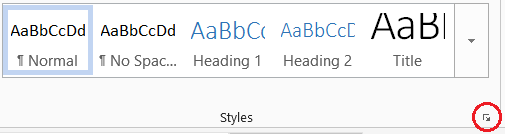
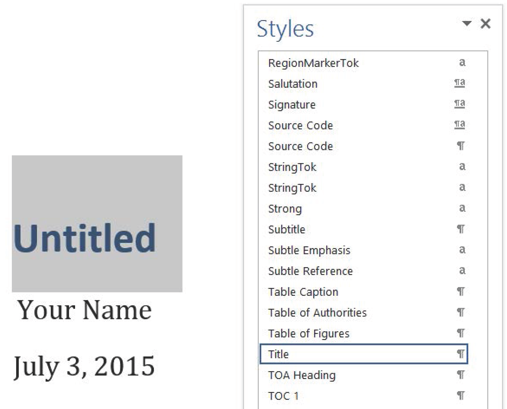
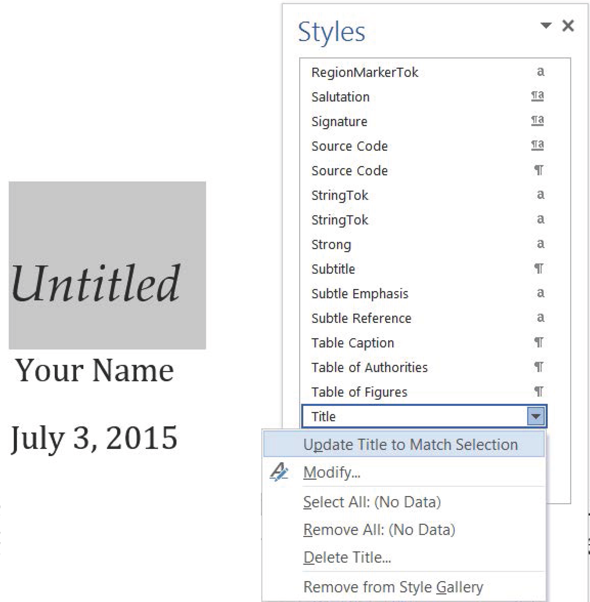
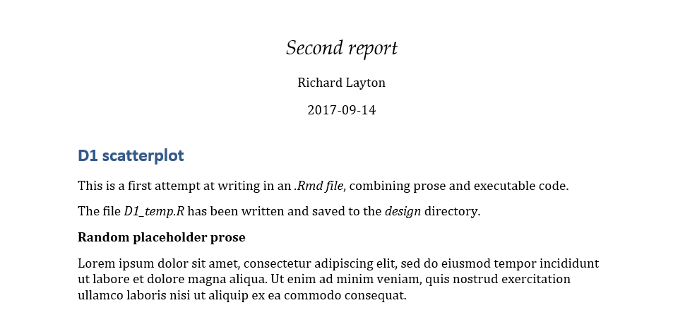
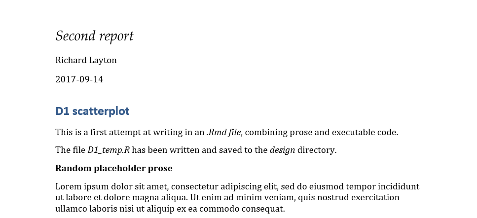
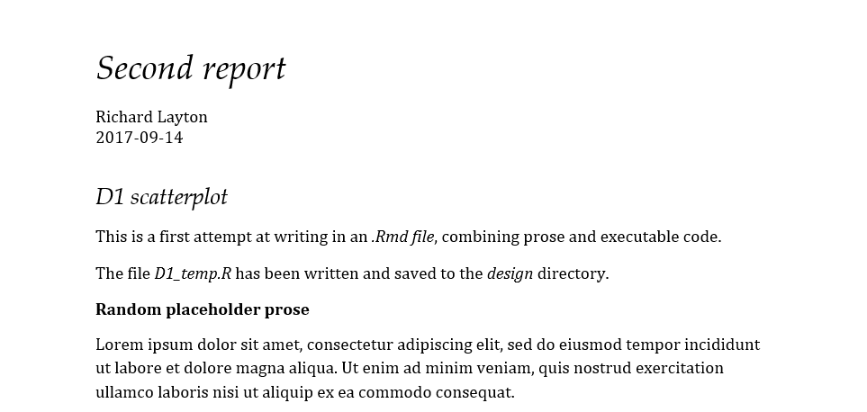

```{r echo=FALSE}
library(knitr)
opts_knit$set(root.dir = "../")
opts_chunk$set(echo = TRUE, message = FALSE, collapse = TRUE, warning = FALSE, cache = TRUE, cache.path = "tut-10-cache/02-", fig.path = "tut-10-images/02-")
```


## creating the styles reference docx 


First create an Rmd file with a Word output.  

- Open a new Rmd script in RStudio 
- Save it as *tut06_draft-word-styles.Rmd* in your *practiceR* directory. 
- In the YAML header, set the output to `output: word_document` 
- Leave all the text as-is, save and knit. 


Save this file

- Save the file with a new name *word-styles-reference-01.docx* 
- Save it to your *practiceR* directory 
- Close *tut06_draft-word-styles.Rmd*

This Word document is the first draft of your styles reference docx file. Its *text content* is irrelevant---its *Style settings* are what you will be using.


## editing the Word styles you find

Continue to work with the *word-styles-reference-01.docx* file. 

- Select the Home ribbon tab  
- In the Styles group click the Styles window launcher (in the lower right corner of the group).




Suppose I want to change the format of the main title. 

- In the Word document, select the title. Here, it reads "Untitled."
- In the Styles window, scroll down until you find the style *already assigned* to the text I selected. In this case, the assigned style is *Title.*




In the Word document, reformat the title 

- Palatino Linotype 
- italic  
- not bold  
- color to black  

With the title reformatted and still selected, click the Title style drop-down menu,  

- select *Update Title to Match Selection*
 
 
 
 
 


## using the Word styles reference file 

- Save *word-styles-reference-01.docx*  
- Close it  

Return to RStudio. 

- Close the *tut06_draft-word-styles.Rmd* file. We won’t use it again. 
- Open *tut04_second-report.Rmd* (or any Rmd script in your *practiceR* directory) 
- Change the YAML header output argument as follows: 


<pre class="r"><code>output:
  word_document:
    reference_docx: "word-styles-reference-01.docx"</code></pre>


Any Rmd script with this header will, when knit, format its output document using the Styles you assigned in the *word-styles-reference-01.docx*. 

- Knit your Rmd script. 

You should see that the format of the title has changed. 
 
 
 


## updating the reference file incrementally 

With your Word output file *tut04_second-report.Rmd* open  

- Open its Styles window  
- Edit the title to be left-aligned and *Update Title to Match Selection* 
- Edit the author's name to be left-aligned and select *Update Author to Match Selection* 
- Edit the date to be left-aligned and select *Update Date to Match Selection* 

This docx file becomes the new, revised styles reference file. 

- Save this open docx file as *word-styles-reference-01.docx*, overwriting the old file 
- Close the file 

Return to your Rmd script. 

- Knit your Rmd script.

A Word file should appear that includes your left-align changes 

 


### exercise

Continue editing the open Word document from ""Second report."

- Title: 24 point
- Author: remove the 10 pt after paragraph  
- Body text: change line spacing to 1.15 
- Heading 1: Not bold, Palatino Linotype, italic, 16 pt. 
- In each case, *Update to Match Selection* 

This docx file becomes the new, revised styles reference file. 

- Save as *word-styles-reference-01.docx*, overwriting the old file 
- Close the reference style file 
- Knit the *second report* Rmd 

Your changes should appear in the new output document. 

 
 
 
## caution using styles 

Use only those styles that exist in the output docx file created by knitr.  

- Do not change a style name. 
- Do not add your own new style. 


## formatting your portfolio

- Knit your portfolio Rmd file with Word output  
- Save the Word file produced as *portfolio-styles-reference-01.docx* in your *portfolio* directory  
- Make some changes to the Styles in the open Word doc and *Update to Match Selection* 
- Close the  file  
- Edit the portfolio YAML header to use this new file as your Word styles reference  
- Knit your portfolio  

The portfolio document you just knitted should now reflect the Styles you assigned in the styles reference file. 


 

 
---

[main page](../README.md)<br> 
[topics page](../README-by-topic.md)


