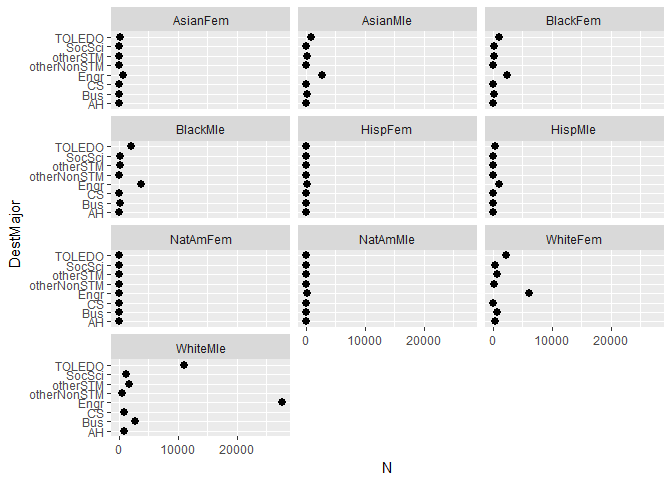
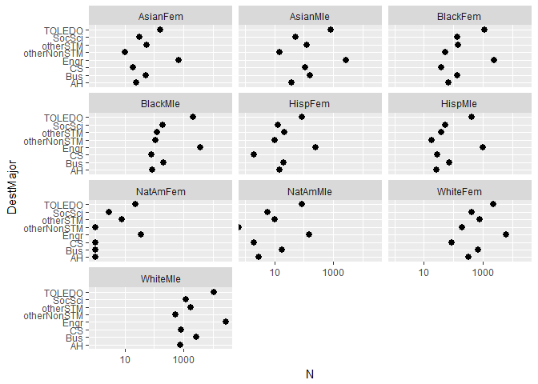
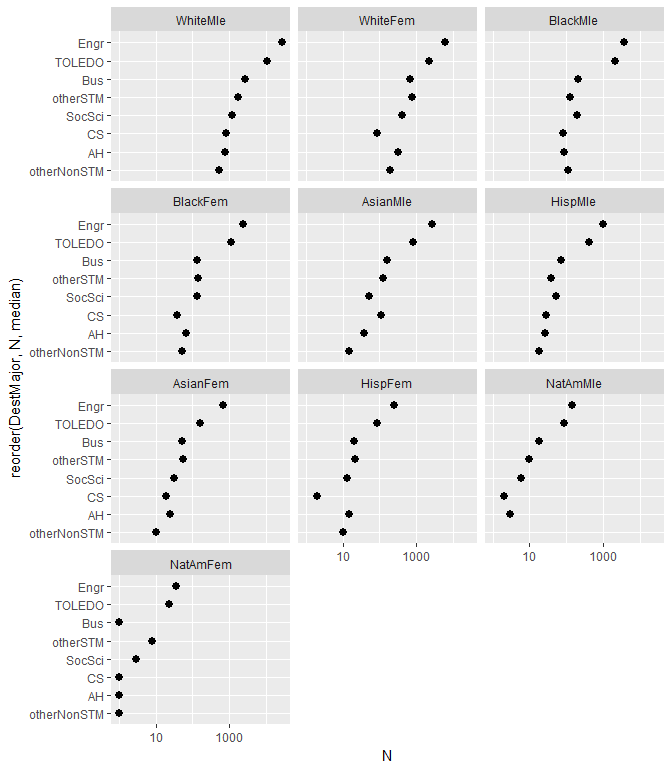
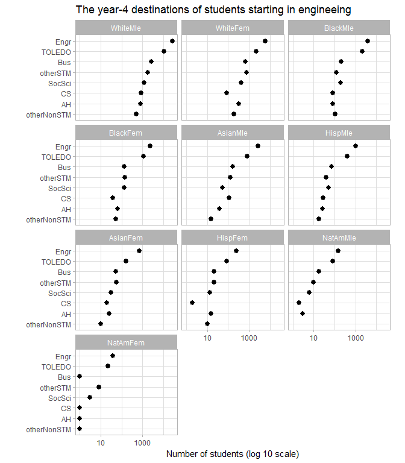
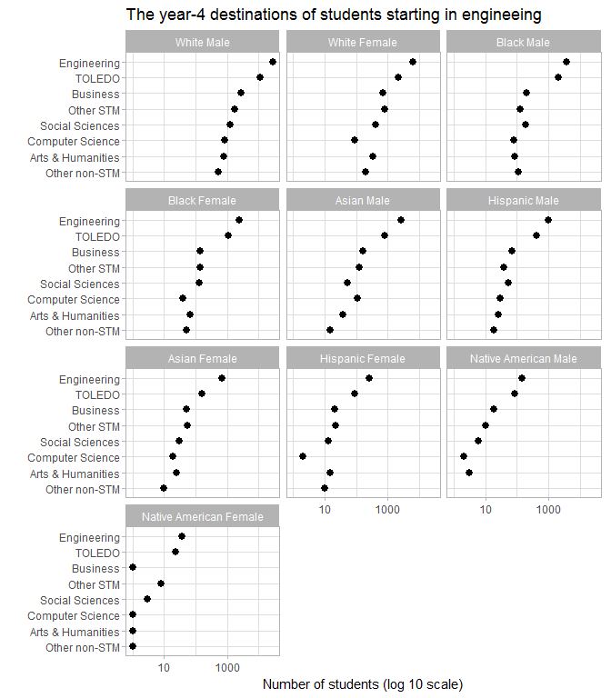
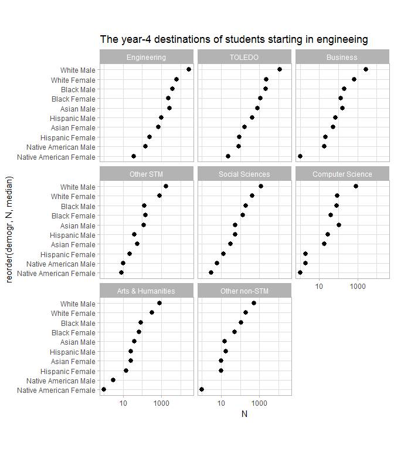

multiway graphs
================

-   [defining multiway data](#defining-multiway-data)
-   [tidying multiway data](#tidying-multiway-data)
-   [graphing multiway data](#graphing-multiway-data)
-   [applying a log scale](#applying-a-log-scale)
-   [recoding character data](#recoding-character-data)
-   [replace the current data frame](#replace-the-current-data-frame)
-   [graphing the dual multiway](#graphing-the-dual-multiway)
-   [saving a graph to file](#saving-a-graph-to-file)
-   [importing an image file](#importing-an-image-file)
-   [bibliography](#bibliography)

defining multiway data
----------------------

Multiway data have a specific structure: two categorical variables, each with its own set of levels, and a single quantitative value for every combination of levels: one level from each category. (Like many data structures, however, we can condition the graph using additional categories.)

For a basic example, in the data table below (Layton, Lord & Ohland, 2009)

-   the category in the column headings is the *demographics* of undergraduates whose first major was engineering
-   the category in the first column is the *destination major* of a student after 4 years in college
-   the quantitative variable is the number *N* of students of each group who arrived at each destination

| DestMajor   |  AsianFem|  AsianMle|  BlackFem|  BlackMle|  HispFem|  HispMle|  NatAmFem|  NatAmMle|  WhiteFem|  WhiteMle|
|:------------|---------:|---------:|---------:|---------:|--------:|--------:|---------:|---------:|---------:|---------:|
| AH          |        25|        38|        66|        85|       15|       26|         1|         3|       329|       791|
| Bus         |        52|       166|       137|       208|       21|       71|         1|        18|       689|      2688|
| CS          |        19|       110|        39|        82|        2|       29|         1|         2|        87|       836|
| Engr        |       699|      2716|      2363|      3788|      250|     1011|        37|       148|      6182|     27722|
| otherNonSTM |        10|        15|        52|       109|       10|       18|         1|         0|       195|       523|
| otherSTM    |        56|       124|       143|       125|       22|       39|         8|        10|       774|      1774|
| SocSci      |        31|        53|       134|       192|       13|       53|         3|         6|       413|      1227|
| TOLEDO      |       162|       803|      1113|      2112|       88|      406|        23|        85|      2213|     10995|

The 8 levels of the destination category are:

-   Arts and Humanities
-   Business
-   Computer Science
-   Engineering
-   Other Non-STM disciplines (STM: Science, Technology, and Math)
-   Other STM disciplines
-   Social Sciences
-   TOLEDO: Destination unknown (left the dataset)

The 10 levels of the demographics category are:

-   Asian American Female and Male
-   Black (African American) Female and Male
-   Hispanic (Latina, Latino) Female and Male
-   Native American Female and Male
-   White (non-Hispanic) Female and Male

A wide table like this one is the most common method of displaying multiway data for a human reader. The quantitative variable is shown at the intersection of every row with every column. If you can display the data table in this way, with the row names listing the different levels of the same category and with the column names listing the different levels of a second category, then you have multiway data.

It isn't tidy data, but it has the multiway structure.

### exercise

For each graph linked to below,

1.  Name the two categorical variables and the one quantitative variable
2.  List the levels of each categorical variable

-   [Hair and eye color](https://blogs.bgsu.edu/statgraphicsakspang/files/2015/06/Blog-9-dot-plot-2.jpeg)
-   [Multiway dot plot A](http://content.csbs.utah.edu/~rogers/datanal/examples/multiway.html)
-   [Multiway dot plot B](http://content.csbs.utah.edu/~rogers/datanal/examples/multiway.html)
-   [How BI customers use their platforms](https://peltiertech.com/some-comments-on-dot-plots-guest-post/)
-   [Earnings disparity by sex](https://plot.ly/python/dot-plots/)

tidying multiway data
---------------------

Download the file *tut11\_student-data.csv* from the github *data* directory and save it in your *data* directory.

Create a new R script *tut11\_gather-student-data.R* in your *data* directory.

Start the R script with your preferred header.

    #  --------------------------------------
    #  gather, tidy, and save multiway data
    #
    #  name 
    #  date
    #  --------------------------------------

Start the script.

``` r
# housekeeping
rm(list = ls())

# packages
library(tidyverse)
```

Read the CSV data file from your data directory.

``` r
df1 <- read_csv('data/tut11_student-data.csv')

glimpse(df1)
## Observations: 8
## Variables: 11
## $ DestMajor <chr> "AH", "Bus", "CS", "Engr", "otherNonSTM", "otherSTM"...
## $ AsianFem  <int> 25, 52, 19, 699, 10, 56, 31, 162
## $ AsianMle  <int> 38, 166, 110, 2716, 15, 124, 53, 803
## $ BlackFem  <int> 66, 137, 39, 2363, 52, 143, 134, 1113
## $ BlackMle  <int> 85, 208, 82, 3788, 109, 125, 192, 2112
## $ HispFem   <int> 15, 21, 2, 250, 10, 22, 13, 88
## $ HispMle   <int> 26, 71, 29, 1011, 18, 39, 53, 406
## $ NatAmFem  <int> 1, 1, 1, 37, 1, 8, 3, 23
## $ NatAmMle  <int> 3, 18, 2, 148, 0, 10, 6, 85
## $ WhiteFem  <int> 329, 689, 87, 6182, 195, 774, 413, 2213
## $ WhiteMle  <int> 791, 2688, 836, 27722, 523, 1774, 1227, 10995
```

Use *gather()* to tidy the data (wide form to long form).

``` r
df2 <- df1 %>% 
    gather(demogr, N, AsianFem:WhiteMle)

glimpse(df2)
## Observations: 80
## Variables: 3
## $ DestMajor <chr> "AH", "Bus", "CS", "Engr", "otherNonSTM", "otherSTM"...
## $ demogr    <chr> "AsianFem", "AsianFem", "AsianFem", "AsianFem", "Asi...
## $ N         <int> 25, 52, 19, 699, 10, 56, 31, 162, 38, 166, 110, 2716...
```

Save the tidy data as a new CSV file in your *data* directory called *tut11\_student-data-tidy.csv*

``` r
write_csv(df2, 'data/tut11_student-data-tidy.csv')
```

Save the script.

graphing multiway data
----------------------

Create a new R script *tut11\_multiway.R* in your *design* directory.

Start the R script with your preferred header.

    #  --------------------------------------
    #  read and graph multiway data
    #
    #  name 
    #  date
    #  --------------------------------------

Start the script.

``` r
# housekeeping
rm(list = ls())

# packages
library(tidyverse)
library(stringr)
```

Read the tidy CSV data file from your data directory.

``` r
df1 <- read_csv('data/tut11_student-data-tidy.csv')

glimpse(df1)
## Observations: 80
## Variables: 3
## $ DestMajor <chr> "AH", "Bus", "CS", "Engr", "otherNonSTM", "otherSTM"...
## $ demogr    <chr> "AsianFem", "AsianFem", "AsianFem", "AsianFem", "Asi...
## $ N         <int> 25, 52, 19, 699, 10, 56, 31, 162, 38, 166, 110, 2716...
```

Plot it.

``` r
f1 <- ggplot(df1, aes(x = N, y = DestMajor)) +
    geom_point(size = 2.5) + 
    facet_wrap(~ demogr, ncol = 3)

print(f1)
```



applying a log scale
--------------------

With data spanning several orders of magnitude, a logarithmic scale let us see small and large differences.

``` r
f1 <- f1 + scale_x_log10()

print(f1)
```



Your console may show a warning message about a transformation error, meaning that one of the N values was zero (log(0) is undefined).

We can filter the data to keep only those rows with *N* &gt; 0.

``` r
df1 <- df1 %>% 
    filter(N > 0)
```

Now reorder panels and rows.

``` r
f2 <- ggplot(df1, aes(x = N, y = reorder(DestMajor, N, median))) +
    geom_point(size = 2.5) + 
    facet_wrap(~ reorder(demogr, -N, median), ncol = 3) + 
    scale_x_log10()

print(f2)
```



Labels and theme

``` r
f2 <- f2 + 
    labs(x = 'Number of students (log 10 scale)', y = ' ', title = 'The year-4 destinations of students starting in engineeing') +
    theme_light() +
    coord_fixed(ratio = 0.5)

print(f2)
```



recoding character data
-----------------------

To make the graph more readable, it is useful to edit the character strings that describe the levels of the two categories, for example, we would like to change `AsianFem` to `Asian Female`.

We'll use

-   *str\_replace\_all()* function from the *stringr* package to replace string segments
-   *mutate()* to create the edited strings and overwrite the original columns

``` r
# recode the categorical data for readability
df2 <- df1 %>% 
    mutate(demogr = str_replace_all(demogr, 
        c("Hisp" = "Hispanic", "NatAm" = "Native American"))) %>% 
    mutate(demogr = str_replace_all(demogr, 
        c("Fem" = " Female", "Mle" = " Male"))) %>% 
    mutate(DestMajor = str_replace_all(DestMajor, 
        c("AH" = "Arts & Humanities", "Bus" = "Business", 
            "CS" = "Computer Science", "Engr" = "Engineering", 
            "otherNonSTM" = "Other non-STM", "SocSci" = "Social Sciences", 
            "otherSTM" = "Other STM")))
```

replace the current data frame
------------------------------

I love the `%+%` operator!

It recreates a graph you already made but substitutes a new data frame that overrides the original data frame.

``` r
# override the data frame to use the readable strings 
f3 <- f2 %+% df2

print(f3)
```



graphing the dual multiway
--------------------------

In the current view, it is easier to compare the data values in a panel, for example, how the numbers for White Males are distributed by major.

If we want to assess how the different ethnicity/sex groups are distributed across a major, we have to switch the roles of rows and panels. To do that, we swap the *y* variable with the *facet\_wrap* variable, creating the *dual* of the original graph.

``` r
# override the aes() and facet_wrap() to swap rows and panels
f4 <- f3 %+% 
    aes(x = N, y = reorder(demogr, N, median)) %+% 
    facet_wrap(~ reorder(DestMajor, -N, median), ncol = 3)

print(f4)
```



When plotting multiway data, I recommend you always plot both versions. One may tell a more compelling story than the other.

saving a graph to file
----------------------

We use the *png()* function to write a graph to file for later import into the Rmd document.

``` r
# start the image PNG device
png(filename = 'visuals/tut11_multiway.png'
    , width  = 6.5
    , height = 5.5
    , units  = 'in'
    , res = 300
    )

# print the figure to PNG
print(f4)

# close the device: necessary
dev.off() 
## png 
##   2
```

Later, when you have imported the image to your Rmd output, if the dimensions need tweaking, change the `width` and `height` arguments of the *png()* function above.

importing an image file
-----------------------

To practice importing an image from the *visuals* directory to an Rmd file, open *tut04\_second-report.Rmd* from your *praticeR* directory.

At the end of the file, add a new header

    # Practice importing an image 

Then add the markup to import an image

    

Knit the Rmd file.

As an alternative, add a code chunk and use the *knitr* function *includegraphics()*.

<pre class="markdown"><code>```{r}
knitr::include_graphics('../visuals/tut11_multiway.png')
<code>```</code></code></pre>
Knit the Rmd file. If you used both methods, you will see the graphic imported twice.

bibliography
------------

Layton, Richard, Susan Lord & Matthew Ohland (2009) Reasoning about categorical data: Multiway plots as useful research tools. In: *ASEE Annual Conference*. Austin, TX.

------------------------------------------------------------------------

[main page](../README.md)<br> [topics page](../README-by-topic.md)
