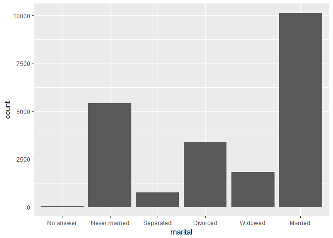
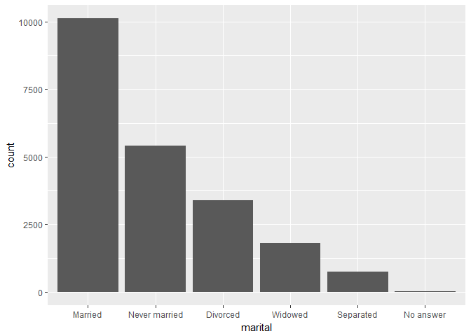
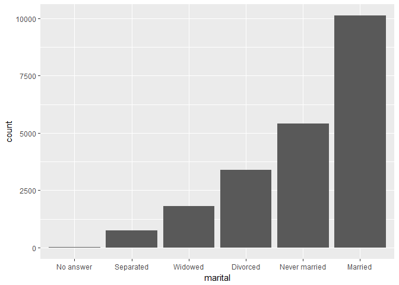
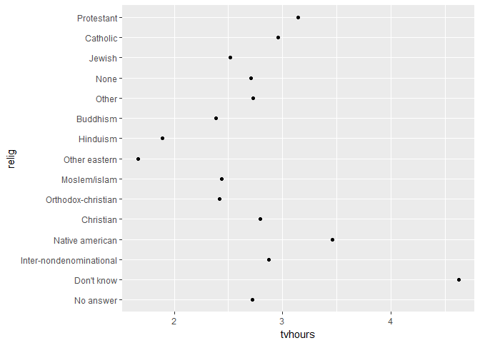
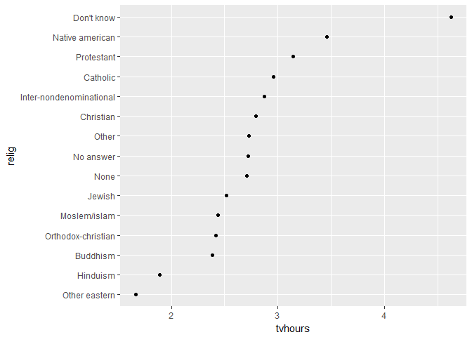
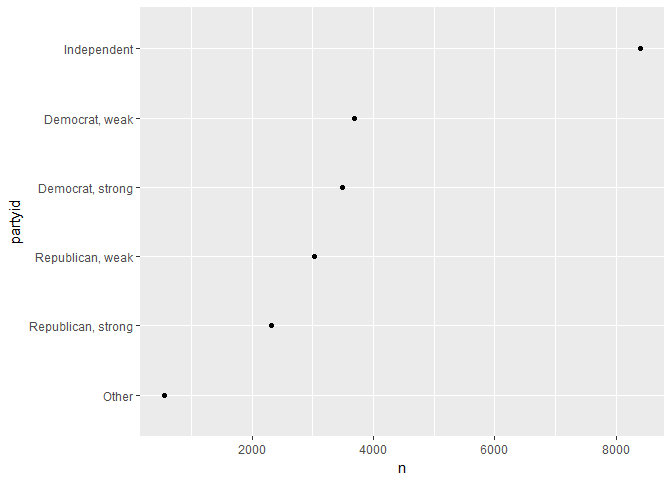
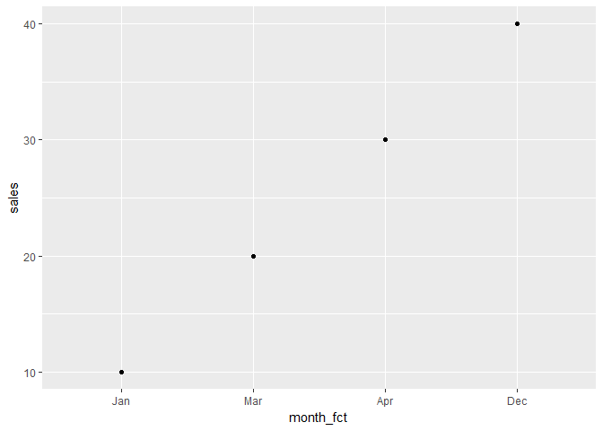

factors
================

-   [preparation](#preparation)
-   [characteristics of a factor variable](#characteristics-of-a-factor-variable)
-   [reorder factor levels by *count()*](#reorder-factor-levels-by-count)
-   [reorder factor levels with *fct\_reorder()*](#reorder-factor-levels-with-fct_reorder)
-   [recoding factor levels with *fct\_recode()*](#recoding-factor-levels-with-fct_recode)
-   [creating a factor variable with *factor()*](#creating-a-factor-variable-with-factor)
-   [bibliography](#bibliography)

preparation
-----------

-   Open a new Rmd script called *tut14\_factors.Rmd*
-   Save it to your *practiceR* folder
-   Edit YAML header
-   Delete the remaining default contents

Add the usual knitr code chunk

    library(knitr)
    opts_knit$set(root.dir = "../")
    opts_chunk$set(echo = TRUE, messages = FALSE)

*forcats* is a package with functions for managing factor variables.

-   Install the *forcats* package.
-   Load the libraries.

<!-- -->

    library(tidyverse)
    library(forcats)

Knit.

characteristics of a factor variable
------------------------------------

As explained by Wickham and Grolemund (2017),

> In R, factors are used to work with categorical variables, variables that have a fixed and known set of possible values. They are also useful when you want to display character vectors in a non-alphabetical order.

The *forcats* package includes a sample from the *General Social Survey*, a long-running US survey.

``` r
# the gss_cat tibble
glimpse(gss_cat)
## Observations: 21,483
## Variables: 9
## $ year    <int> 2000, 2000, 2000, 2000, 2000, 2000, 2000, 2000, 2000, ...
## $ marital <fctr> Never married, Divorced, Widowed, Never married, Divo...
## $ age     <int> 26, 48, 67, 39, 25, 25, 36, 44, 44, 47, 53, 52, 52, 51...
## $ race    <fctr> White, White, White, White, White, White, White, Whit...
## $ rincome <fctr> $8000 to 9999, $8000 to 9999, Not applicable, Not app...
## $ partyid <fctr> Ind,near rep, Not str republican, Independent, Ind,ne...
## $ relig   <fctr> Protestant, Protestant, Protestant, Orthodox-christia...
## $ denom   <fctr> Southern baptist, Baptist-dk which, No denomination, ...
## $ tvhours <int> 12, NA, 2, 4, 1, NA, 3, NA, 0, 3, 2, NA, 1, NA, 1, 7, ...
```

Note the number of variables that are factors.

Factors have a fixed and known set of possible values. To illustrate, let's extract the *marital* column from the *gss\_cat* tibble

``` r
# subset one column of the data frame
marital_col <- gss_cat$marital
```

The syntax `data_frame$column_name` extracts the column from the data frame as a stand-alone object.

Confirm that the column is a factor with *class()*

``` r
# examine its structure
class(marital_col)
## [1] "factor"
```

Show the set of fixed and known possible values of the factor

``` r
# its levels
levels(marital_col)
## [1] "No answer"     "Never married" "Separated"     "Divorced"     
## [5] "Widowed"       "Married"
```

R internally codes factors as integers (that's how factors can be ordered or re-ordered)

``` r
# it is in fact an integer type
typeof(marital_col)
## [1] "integer"
```

To see the first few integers, let's look at the first few data values in *marital* and then *unclass()* them to reveal the hidden integers

``` r
# first 15 entries 
marital_col[1:15]
##  [1] Never married Divorced      Widowed       Never married Divorced     
##  [6] Married       Never married Divorced      Married       Married      
## [11] Married       Married       Married       Married       Divorced     
## Levels: No answer Never married Separated Divorced Widowed Married

# are coded in R as integers 
unclass(marital_col[1:15])
##  [1] 2 4 5 2 4 6 2 4 6 6 6 6 6 6 4
## attr(,"levels")
## [1] "No answer"     "Never married" "Separated"     "Divorced"     
## [5] "Widowed"       "Married"
```

Thus with a factor variable, the data entries you *see* are the character-string levels of the factor. The integer assigned to each level is hidden. To reorder the levels of the factor we have to reassign (reorder) the hidden integers.

reorder factor levels by *count()*
----------------------------------

We can use *count()* to create a summary of the original data frame that counts the number of observations for each level in a factor.

``` r
# use count() to sum the frequency of each level of a factor
gss_cat %>% 
    count(marital)
## # A tibble: 6 x 2
##         marital     n
##          <fctr> <int>
## 1     No answer    17
## 2 Never married  5416
## 3     Separated   743
## 4      Divorced  3383
## 5       Widowed  1807
## 6       Married 10117
```

The same data can be quickly assessed in a bar chart

``` r
# bar charts are useful for a quick graph of counts 
ggplot(data = gss_cat) +
    geom_bar(aes(marital))
```



Reorder factors levels by frequency, we use *fct\_infreq()* inside *mutate()*

``` r
# order a factor by frequency of observations
gss_cat <- gss_cat %>% 
    mutate(marital = marital %>% fct_infreq())

# bar chart with the factor now ordered 
ggplot(data = gss_cat) +
    geom_bar(aes(marital))
```



To reverse the order, use *fct\_rev()*

``` r
# reverse the order of factors 
gss_cat <- gss_cat %>% 
    mutate(marital = marital %>% fct_infreq() %>% fct_rev())

# bar chart
ggplot(data = gss_cat) +
    geom_bar(aes(marital))
```



reorder factor levels with *fct\_reorder()*
-------------------------------------------

Let's explore the average number of hours spent watching TV per day across religions:

``` r
# group by the religion factor and summarize 
this_group    <- group_by(gss_cat, relig)
relig_summary <- summarize(
    this_group,
    age     = mean(age, na.rm = TRUE),
    tvhours = mean(tvhours, na.rm = TRUE),
    n       = n()
    )

# see the result
relig_summary
## # A tibble: 15 x 4
##                      relig      age  tvhours     n
##                     <fctr>    <dbl>    <dbl> <int>
##  1               No answer 49.49412 2.723404    93
##  2              Don't know 35.93333 4.625000    15
##  3 Inter-nondenominational 39.96330 2.870370   109
##  4         Native american 38.86957 3.461538    23
##  5               Christian 40.05240 2.790281   689
##  6      Orthodox-christian 50.42105 2.416667    95
##  7            Moslem/islam 37.62136 2.437500   104
##  8           Other eastern 45.90625 1.666667    32
##  9                Hinduism 37.67143 1.891892    71
## 10                Buddhism 44.69388 2.382716   147
## 11                   Other 41.04054 2.725806   224
## 12                    None 41.16392 2.710227  3523
## 13                  Jewish 52.39535 2.518519   388
## 14                Catholic 46.90825 2.960297  5124
## 15              Protestant 49.90422 3.145487 10846
```

Graph the result with the factor as the row variable.

``` r
# the levels of the factor are the row labels 
ggplot(data = relig_summary) + 
    geom_point(aes(x = tvhours, y = relig))
```



Edit the data frame using *fct\_reorder()* to reorder the factors based on the number of hours of TV watched.

``` r
# reorder the levels of the factor by number of TV hours
relig_summary <- relig_summary %>%
  mutate(relig = fct_reorder(relig, tvhours))
```

The factor was reordered in the data frame, so we do not have to use a *reorder()* in the graph aesthetics.

``` r
# graph with reordered factor  
ggplot(data = relig_summary) + 
    geom_point(aes(x = tvhours, y = relig))
```



recoding factor levels with *fct\_recode()*
-------------------------------------------

Let's summarise the data by political party identification.

``` r
# count the frequency of party ID in the dataset
df1 <- gss_cat %>% 
    count(partyid)

df1
## # A tibble: 10 x 2
##               partyid     n
##                <fctr> <int>
##  1          No answer   154
##  2         Don't know     1
##  3        Other party   393
##  4  Strong republican  2314
##  5 Not str republican  3032
##  6       Ind,near rep  1791
##  7        Independent  4119
##  8       Ind,near dem  2499
##  9   Not str democrat  3690
## 10    Strong democrat  3490
```

*fct\_recode()* allows you to recode, or change, the value of each level of a factor---especially useful for preparing a graph for publication.

``` r
df2 <- gss_cat %>% 
    mutate(partyid = fct_recode(partyid,
    "Republican, strong"    = "Strong republican",
    "Republican, weak"      = "Not str republican",
    "Independent, near rep" = "Ind,near rep",
    "Independent, near dem" = "Ind,near dem",
    "Democrat, weak"        = "Not str democrat",
    "Democrat, strong"      = "Strong democrat"
  )) %>% 
    count(partyid)

df2
## # A tibble: 10 x 2
##                  partyid     n
##                   <fctr> <int>
##  1             No answer   154
##  2            Don't know     1
##  3           Other party   393
##  4    Republican, strong  2314
##  5      Republican, weak  3032
##  6 Independent, near rep  1791
##  7           Independent  4119
##  8 Independent, near dem  2499
##  9        Democrat, weak  3690
## 10      Democrat, strong  3490
```

To combine groups, you can assign multiple old levels to the same new level:

``` r
party_summary <- gss_cat %>% 
    mutate(partyid = fct_recode(partyid,
    "Republican, strong"    = "Strong republican",
    "Republican, weak"      = "Not str republican",
    "Independent"           = "Ind,near rep",
    "Independent"           = "Ind,near dem",
    "Democrat, weak"        = "Not str democrat",
    "Democrat, strong"      = "Strong democrat",
    "Other"                 = "No answer",
    "Other"                 = "Don't know",
    "Other"                 = "Other party"
  )) %>% count(partyid)

party_summary
## # A tibble: 6 x 2
##              partyid     n
##               <fctr> <int>
## 1              Other   548
## 2 Republican, strong  2314
## 3   Republican, weak  3032
## 4        Independent  8409
## 5     Democrat, weak  3690
## 6   Democrat, strong  3490
```

``` r
# reorder the row labels by the count n
party_summary <- party_summary %>%
  mutate(partyid = fct_reorder(partyid, n))

ggplot(data = party_summary) + 
    geom_point(aes(x = n, y = partyid))
```



creating a factor variable with *factor()*
------------------------------------------

If your variable is a character but you wish to use the factor functions described here, you can mutate a character variable into a factor variable.

For example, suppose your data has a variable with a few months in it,

``` r
# create a data frame with a caharacter variable 
df <- data_frame(
    month = c("Dec", "Apr", "Jan", "Mar"), 
    sales = c(40, 30, 10, 20)
    )

glimpse(df)
## Observations: 4
## Variables: 2
## $ month <chr> "Dec", "Apr", "Jan", "Mar"
## $ sales <dbl> 40, 30, 10, 20
```

If we graph this data (no factors) so we'll get alphabetical ordering

``` r
# the months are in alphabetical order
ggplot(data = df) +
    geom_point(aes(x = month, y = sales))
```


Recall that a factor variable has a *fixed* and *known* set of possible values. For example, the number of months and their names are fixed and known,

``` r
# create a the known and fixed set of levels for the new factor variable 
month_levels <- c(
  "Jan", "Feb", "Mar", "Apr", "May", "Jun", 
  "Jul", "Aug", "Sep", "Oct", "Nov", "Dec"
)
```

Creating the levels in this order establishes the integer order of the levels.

``` r
# create the factor variable using mutate() and factor() 
df <- df %>% 
    mutate(month_fct = factor(month, levels = month_levels))
df
## # A tibble: 4 x 3
##   month sales month_fct
##   <chr> <dbl>    <fctr>
## 1   Dec    40       Dec
## 2   Apr    30       Apr
## 3   Jan    10       Jan
## 4   Mar    20       Mar
```

The same graph as before, but with a factor set of months instead of the original character set of months.

``` r
ggplot(data = df) +
    geom_point(aes(x = month_fct, y = sales))
```



So now the order of the months is correct (not alphabetical).

However, months along an x-axis suggest a time series, and we should never use a time series where the tick marks are not equal increments. So I would not use this graph without including all the months along the x-axis.

bibliography
------------

Wickham, Hadley & Garrett Grolemund (2017) *R for data Science*. O’Reilly.

------------------------------------------------------------------------

[main page](../README.md)<br> [topics page](../README-by-topic.md)
