displaying univariate data
================

-   [data preparation](#data-preparation)
-   [gather and tidy univariate data](#gather-and-tidy-univariate-data)
-   [design preparation](#design-preparation)
-   [show all the data](#show-all-the-data)
-   [box plots](#box-plots)
-   [be skeptical of 2-value summaries](#be-skeptical-of-2-value-summaries)
-   [histograms](#histograms)
-   [exercise](#exercise)
-   [bibliography](#bibliography)

data preparation
----------------

Always start your work session by launching the .Rproj file you created for this course. Using an R Project automatically sets the working directory to your course folder, making relative file paths easy to use.

-   File → Recent projects → me447\_visualizing-data.Rproj
-   Open a new R script called *tut15\_gather\_univariate.R*
-   Save it to your *practiceR* folder
-   Download the xlsx file *univariate\_doumont\_cases.xlsx* from the *data* directory on GitHub.
-   Save to your *data* directory.

In the R script, type your usual header

    #  ------------------------------------------
    #  gathering and tidying univariate data
    #
    #  name
    #  date
    #  ------------------------------------------

and add the usual knitr code chunk

    library(knitr)
    opts_knit$set(root.dir = "../")
    opts_chunk$set(echo = TRUE, messages = FALSE)

gather and tidy univariate data
-------------------------------

Housekeeping

``` r
# housekeeping
rm(list = ls())
```

Packages

``` r
# packages
library(tidyverse)
library(forcats)
library(readxl)
```

Read the xlsx file and display it

``` r
# read the file
df1 <- read_excel('data/univariate_doumont_cases.xlsx')

# have a look
glimpse(df1)
## Observations: 17
## Variables: 4
## $ case1 <dbl> 5.050, 5.875, 6.700, 7.525, 8.350, 9.175, 10.000, 10.825...
## $ case2 <dbl> 1.30, 3.15, 8.75, 11.25, 11.50, 11.70, 11.90, 12.05, 12....
## $ case3 <dbl> 7.3000, 7.7154, 8.1308, 8.5462, 8.9616, 9.3770, 9.7924, ...
## $ case4 <dbl> 6.0500, 6.4667, 6.8834, 7.3001, 7.7168, 8.1335, 8.5502, ...
```

It's small enough to print as a table

``` r
# small enough to print
kable(df1)
```

|   case1|  case2|    case3|    case4|
|-------:|------:|--------:|--------:|
|   5.050|   1.30|   7.3000|   6.0500|
|   5.875|   3.15|   7.7154|   6.4667|
|   6.700|   8.75|   8.1308|   6.8834|
|   7.525|  11.25|   8.5462|   7.3001|
|   8.350|  11.50|   8.9616|   7.7168|
|   9.175|  11.70|   9.3770|   8.1335|
|  10.000|  11.90|   9.7924|   8.5502|
|  10.825|  12.05|  10.2078|  10.0000|
|  11.650|  12.30|  10.6232|  11.6500|
|  12.475|  12.40|  11.0386|  13.3000|
|  13.300|  12.70|  11.4540|  14.7500|
|  14.125|  12.90|  11.8694|  15.1500|
|  14.950|  13.00|  12.2848|  15.5500|
|  15.775|  13.55|  12.7002|  16.0000|
|  16.600|  13.85|  15.5000|  16.4500|
|  17.425|  17.55|  20.6500|  16.7500|
|  18.250|  18.30|  22.0000|  17.2500|

The data are not tidy. We have one category (case number) and one measurement.

``` r
# tidy the data
df2 <- df1 %>% 
    gather(case_number, measurement, case1:case4)

# check it
glimpse(df2)
## Observations: 68
## Variables: 2
## $ case_number <chr> "case1", "case1", "case1", "case1", "case1", "case...
## $ measurement <dbl> 5.050, 5.875, 6.700, 7.525, 8.350, 9.175, 10.000, ...
```

Let's turn the case number into a factor.

``` r
# create a the known and fixed set of levels for the new factor variable 
case_levels <- c(
  "case1", "case2", "case3", "case4" 
  )

# create the factor variable using mutate() and factor() 
df3 <- df2 %>% 
    mutate(case_number = factor(case_number, levels = case_levels))

# check
glimpse(df3)
## Observations: 68
## Variables: 2
## $ case_number <fctr> case1, case1, case1, case1, case1, case1, case1, ...
## $ measurement <dbl> 5.050, 5.875, 6.700, 7.525, 8.350, 9.175, 10.000, ...
```

Then recode the factor for readability later.

``` r
df3 <- df3 %>% 
    mutate(case_number = fct_recode(case_number,
        "Case 1" = "case1", # new = old
        "Case 2" = "case2",
        "Case 3" = "case3",
        "Case 4" = "case4"
))

# check
glimpse(df3)
## Observations: 68
## Variables: 2
## $ case_number <fctr> Case 1, Case 1, Case 1, Case 1, Case 1, Case 1, C...
## $ measurement <dbl> 5.050, 5.875, 6.700, 7.525, 8.350, 9.175, 10.000, ...
```

Write the tidy data to file.

``` r
write_csv(df3, 'data/univariate_doumont_cases.csv')
```

design preparation
------------------

For your project of course, "gather-data" scripts would be in your *data* directory and "graph design" scripts would be in your *design* directory. But we'll save all tutorial scripts in the *practiceR* directory.

-   Open a new R script called *tut15\_design\_univariate.R*
-   Save it to your *practiceR* folder

In the R script, type your usual header

    #  ------------------------------------------
    #  graphs of univariate data
    #
    #  name
    #  date
    #  ------------------------------------------

and add the usual knitr code chunk

    library(knitr)
    opts_knit$set(root.dir = "../")
    opts_chunk$set(echo = TRUE, messages = FALSE)

Housekeeping

``` r
# housekeeping
rm(list = ls())
```

Packages

``` r
# packages
library(tidyverse)
```

Read the CSV data file

``` r
df1 <- read_csv('data/univariate_doumont_cases.csv')
```

show all the data
-----------------

Make a dotplot of the cases. Each row will have as many dots as there are measurements by case number.

``` r
ggplot(data = df1, aes(x = measurement, y = case_number)) +
    geom_point() +
    labs(y = "", x = "Distribution of measurement")
```

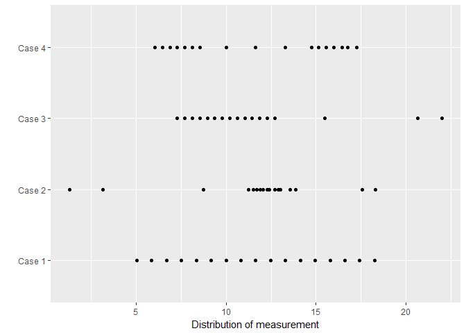

What we see is the distribution of a single variable conditioned by the category I called "case". If the data markers do not overprint too badly, this is an ideal approach to showing a distribution: we have not summarized it in any way.

box plots
---------

To facilitate comparisons between the 4 cases, a box plot is probably your first and best alternative: the box plot (more precisely called a box and whisker plot) is a "5-value summary" of the data, showing the median and four quartiles plus outliers.

``` r
f2 <- ggplot(data = df1, aes(x = case_number, y = measurement)) +
    geom_boxplot() +
    labs(x = "", y = "Distribution of measurement")

f2
```

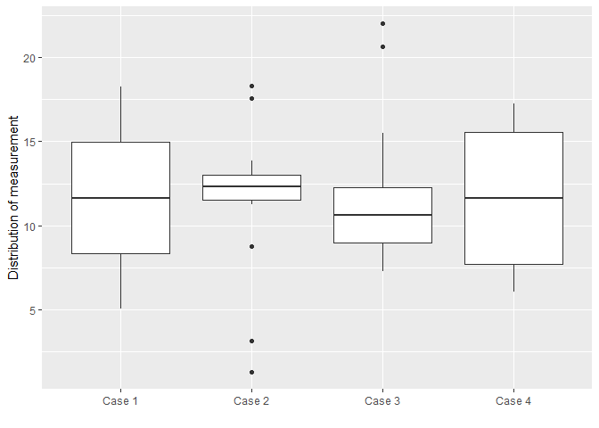

The default box plot orientation in *ggplot2* is vertical. To swap the axes, we use *coord\_flip()*.

``` r
f3 <- f2 + 
    coord_flip()

f3
```

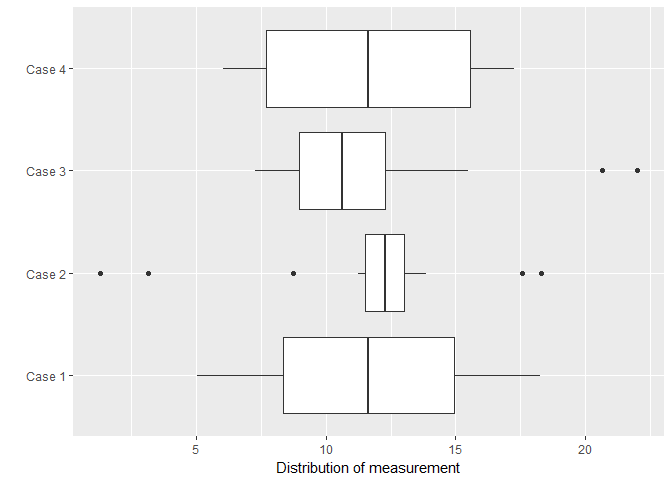

When comparing distributions, reorder use the median value.

``` r
f4 <- ggplot(data = df1,aes(x = reorder(case_number, measurement, median), y = measurement)) +
    geom_boxplot() +
    labs(x = "", y = "Distribution of measurement") +
    coord_flip()

f4
```

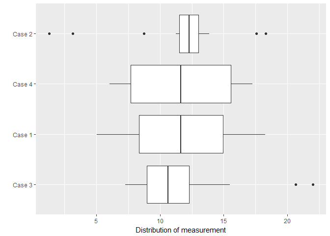

You can also add the data markers on top of the boxplot to show all the data and the 5-point summary.

``` r
f5 <- f4 + 
    geom_jitter(width = 0.02)

f5
```

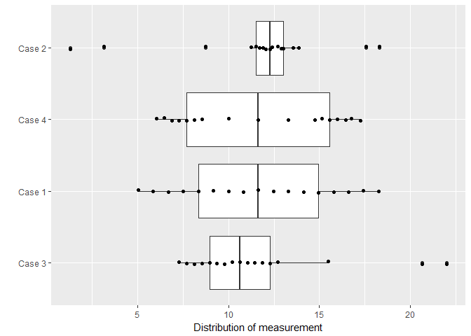

be skeptical of 2-value summaries
---------------------------------

This example is adapted from (Doumont, 2009).

Let's recall the original distribution

``` r
f6 <- ggplot(data = df1, aes(x = measurement, y = case_number)) +
  geom_point() +
  labs(y = "", x = "Distribution of measurement") + 
    scale_x_continuous(limits = c(0, 25))

f6
```

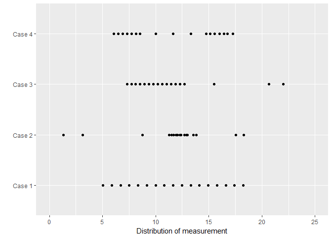

Let's create a commonly encountered "2-value summary" of distributed univariate data: means and standard deviations.

``` r
this_group <- group_by(df1, case_number)
df2 <- summarize(
    this_group, 
    mean = mean(measurement), 
    sd = sd(measurement)
)
```

Let's fade out the data and overlay the means ± 1 standard deviation. Notice in this code how we can use *ggplot()* with no arguments, then use a different data frame and aesthetic in each *geom.*

``` r
ggplot() + 
  geom_point(data = df1
    , aes(x = case_number, y = measurement), alpha = 0.3) +
  geom_linerange(data = df2
    , aes(x = case_number, ymin = mean - sd, ymax = mean + sd), color = 'darkgoldenrod3', size = 1) +
    geom_point(data = df2
        , aes(x = case_number, y = mean), color = 'darkgoldenrod3', size = 2.5) +
    labs(x = "", y = "Distribution summary") + 
    scale_y_continuous(limits = c(0, 25)) + 
    coord_flip()
```

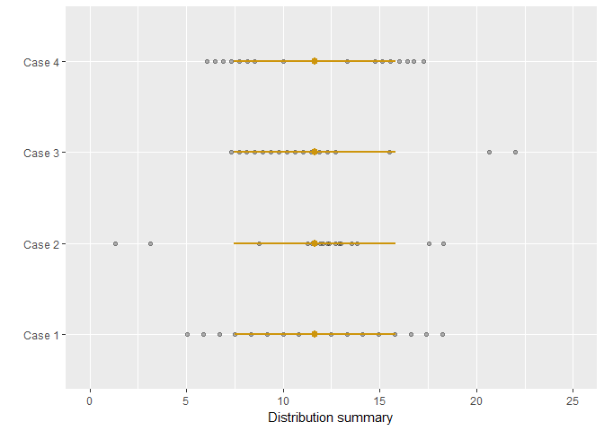

Of course if the author only showed you the 2-value summary (means and standard deviation), all you would see is this,

``` r
ggplot() + 
  geom_linerange(data = df2
    , aes(x = case_number, ymin = mean - sd, ymax = mean + sd), color = 'darkgoldenrod3', size = 1) +
    geom_point(data = df2
        , aes(x = case_number, y = mean), color = 'darkgoldenrod3', size = 2.5) +
    labs(x = "", y = "Distribution summary") + 
    scale_y_continuous(limits = c(0, 25)) +
    coord_flip()
```

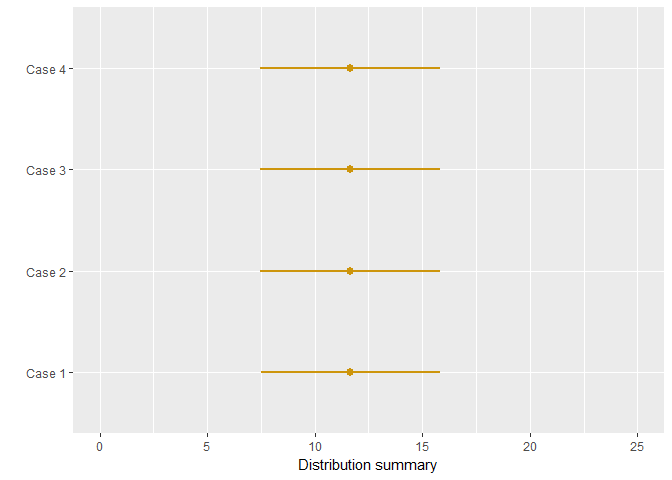

You would never know that the 4 cases had quite different distributions. If we print the table of means and standard deviations, you can see that our source carefully constructed these data so they would have different distributions but identical 2-value summaries.

``` r
kable(df2, digits = 1)
```

| case\_number |  mean|   sd|
|:-------------|-----:|----:|
| Case 1       |  11.6|  4.2|
| Case 2       |  11.7|  4.2|
| Case 3       |  11.7|  4.2|
| Case 4       |  11.6|  4.2|

Conclusion: Be skeptical if someone draws conclusions from means and standard deviations only.

histograms
----------

I recommend box and whisker plots for comparing distributions, but histograms are occasionally useful. You can edit the *binwidth* argument to change the display (which is why histograms are subject to rhetorical malpractice).

``` r
# histogram
ggplot(data = df1, aes(measurement)) +
    geom_histogram(binwidth = 1) +
    facet_grid(~case_number)
```

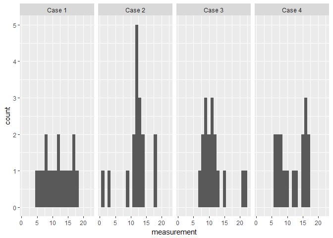

Or you can use a frequency polygon, sort of a connect-the-dots histogram. Again, bin width can be adjusted.

``` r
# frequency polygon
ggplot(data = df1, aes(measurement)) +
    geom_freqpoly(binwidth = 1) +
    facet_grid(~case_number)
```

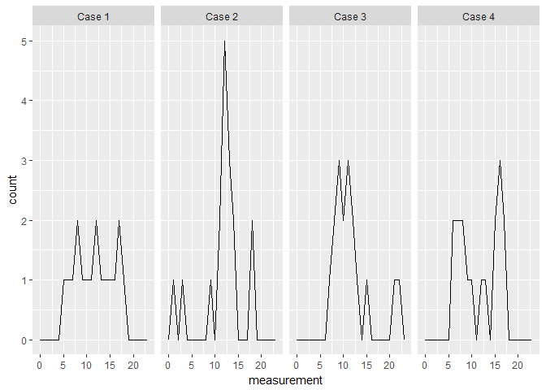

Or you might try the kernel density estimate, a smoothed version of the histogram. You can tweak the contours by changing the *adjust* argument.

``` r
ggplot(data = df1, aes(measurement)) +
    geom_density(adjust = 1, fill = 'darkgoldenrod3', alpha = 0.3) +
    facet_grid(~case_number)
```

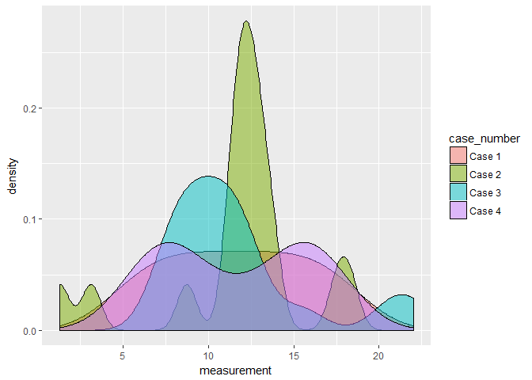

You could try overlaying the cases in one panel

``` r
ggplot(data = df1, aes(measurement, fill = case_number)) +
    geom_density(adjust = 1, alpha = 0.5)
```


With too many cases overlapping, visual comparisons become more difficult.

exercise
--------

I've adapted this exercise from (Unwin, 2015).

-   Install the package *GDAdata*

``` r
# use the SpeedSki data from the GDAdata package
library(tidyverse)
library(GDAdata)
data(SpeedSki)
```

The *SpeedSki* data contains the speeds of competitors in the 2011 World Speed Skiing Championships by event and sex. The speed data are univariate: the single measured quantity is speed.

1.  Display a histogram of speeds conditioned by sex. What story do you think you see?
2.  Draw the same data as a boxplot. What story do you see?
3.  Repeat the histogram, but add facets conditioned by sex and event. What story do you think see?
4.  Draw the same data as a box plot. What conclusions do you make now?

[Click here](tut-15-images/tut15_boxplot.png) to see my solution to question 4.

bibliography
------------

Doumont, Jean-luc (2009) *Trees, Maps, and Theorems: Effective Communication for Rational Minds*. 2nd ed. Kraainem, Belgium: Principiae.

Unwin, Antony (2015) *Graphical Data Analysis with R*. CRC Press, Taylor & Francis.

------------------------------------------------------------------------

[main page](../README.md)<br> [topics page](../README-by-topic.md)
