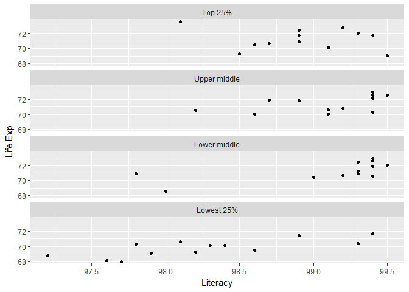

data transformation, part 2
================

-   [preparation](#preparation)
-   [spread()](#spread)
-   [unite() and separate()](#unite-and-separate)
-   [joins](#joins)
-   [rbind()](#rbind)
-   [cut()](#cut)
-   [exercises](#exercises)
-   [bibliography](#bibliography)

preparation
-----------

Always start your work session by launching the .Rproj file you created for this course. Using an R Project automatically sets the working directory to your course folder, making relative file paths easy to use.

-   File → Recent projects → me447\_visualizing-data.Rproj
-   Download *DSR-tables.xlsx* from the website *data* directory
-   Save it to your *data* directory
-   Open a new R script called *tut22\_data-transformation.R*
-   Save it to your *practiceR* folder

In the R script, type your usual header

    #  ------------------------------------------
    #  data transformation, part 2
    #
    #  name
    #  date
    #  ------------------------------------------

and add the usual knitr code chunk

    library(knitr)
    opts_knit$set(root.dir = "../")
    opts_chunk$set(echo = TRUE, messages = FALSE)

spread()
--------

``` r
library(tidyverse)
library(readxl)
library(forcats)
```

We've seen gather() before as a method of converting a wide data structure to a tidy data structure.

*spread()* is the opposite of *gather()* You use it when an observation is scattered across multiple rows.

Read the worksheet named *table2* from the *DST-tables.xlsx*

``` r
table2 <- read_excel('data/DSR-tables.xlsx', sheet = 'table2')

kable(table2)
```

| country     |  year| type       |           N|
|:------------|-----:|:-----------|-----------:|
| Afghanistan |  1999| cases      |         745|
| Afghanistan |  1999| population |    19987071|
| Afghanistan |  2000| cases      |        2666|
| Afghanistan |  2000| population |    20595360|
| Brazil      |  1999| cases      |       37737|
| Brazil      |  1999| population |   172006362|
| Brazil      |  2000| cases      |       80488|
| Brazil      |  2000| population |   174504898|
| China       |  1999| cases      |      212258|
| China       |  1999| population |  1272915272|
| China       |  2000| cases      |      213766|
| China       |  2000| population |  1280428583|

Here the data are not tidy. For example, the 1999 Afghanistan data is written in two rows, not one. The "type" and "count" variables need to be transformed into two columns called "cases" and "population".

We do that with *spread()*

``` r
table2a <- spread(data = table2, key = type, value = N)

kable(table2a)
```

| country     |  year|   cases|  population|
|:------------|-----:|-------:|-----------:|
| Afghanistan |  1999|     745|    19987071|
| Afghanistan |  2000|    2666|    20595360|
| Brazil      |  1999|   37737|   172006362|
| Brazil      |  2000|   80488|   174504898|
| China       |  1999|  212258|  1272915272|
| China       |  2000|  213766|  1280428583|

The entries in the column identified as the "key" become the new columns (variable names). The entries in the "value" are the data entered in the new columns under the new column names.

*spread()* is also useful in taking a tidy data frame and making it wide for a print document. For example, in an earlier tutorial, we created a tidy dataset called *tut11\_student-data-tidy.csv*. Let;'s read it and use spread to make it a wide table.

``` r
df3 <- read_csv('data/tut11_student-data-tidy.csv')

glimpse(df3)
## Observations: 80
## Variables: 3
## $ DestMajor <chr> "AH", "Bus", "CS", "Engr", "otherNonSTM", "otherSTM"...
## $ demogr    <chr> "AsianFem", "AsianFem", "AsianFem", "AsianFem", "Asi...
## $ N         <int> 25, 52, 19, 699, 10, 56, 31, 162, 38, 166, 110, 2716...
```

Let's try spreading the demographics as column names

``` r
df4 <- df3 %>% 
    spread(key = demogr, value = N)

kable(df4)
```

| DestMajor   |  AsianFem|  AsianMle|  BlackFem|  BlackMle|  HispFem|  HispMle|  NatAmFem|  NatAmMle|  WhiteFem|  WhiteMle|
|:------------|---------:|---------:|---------:|---------:|--------:|--------:|---------:|---------:|---------:|---------:|
| AH          |        25|        38|        66|        85|       15|       26|         1|         3|       329|       791|
| Bus         |        52|       166|       137|       208|       21|       71|         1|        18|       689|      2688|
| CS          |        19|       110|        39|        82|        2|       29|         1|         2|        87|       836|
| Engr        |       699|      2716|      2363|      3788|      250|     1011|        37|       148|      6182|     27722|
| otherNonSTM |        10|        15|        52|       109|       10|       18|         1|         0|       195|       523|
| otherSTM    |        56|       124|       143|       125|       22|       39|         8|        10|       774|      1774|
| SocSci      |        31|        53|       134|       192|       13|       53|         3|         6|       413|      1227|
| TOLEDO      |       162|       803|      1113|      2112|       88|      406|        23|        85|      2213|     10995|

Or, we could spread the destination majors instead

``` r
df5 <- df3 %>% 
    spread(key = DestMajor, value = N)

kable(df5)
```

| demogr   |   AH|   Bus|   CS|   Engr|  otherNonSTM|  otherSTM|  SocSci|  TOLEDO|
|:---------|----:|-----:|----:|------:|------------:|---------:|-------:|-------:|
| AsianFem |   25|    52|   19|    699|           10|        56|      31|     162|
| AsianMle |   38|   166|  110|   2716|           15|       124|      53|     803|
| BlackFem |   66|   137|   39|   2363|           52|       143|     134|    1113|
| BlackMle |   85|   208|   82|   3788|          109|       125|     192|    2112|
| HispFem  |   15|    21|    2|    250|           10|        22|      13|      88|
| HispMle  |   26|    71|   29|   1011|           18|        39|      53|     406|
| NatAmFem |    1|     1|    1|     37|            1|         8|       3|      23|
| NatAmMle |    3|    18|    2|    148|            0|        10|       6|      85|
| WhiteFem |  329|   689|   87|   6182|          195|       774|     413|    2213|
| WhiteMle |  791|  2688|  836|  27722|          523|      1774|    1227|   10995|

Before printing either table to a document, I would back up and recode the demographics and destination majors to make them more readable.

unite() and separate()
----------------------

Read the worksheet named *table3* from the *DST-tables.xlsx*

``` r
df6 <- read_excel('data/DSR-tables.xlsx', sheet = 'table3')

kable(df6)
```

| country     |  year| rate              |
|:------------|-----:|:------------------|
| Afghanistan |  1999| 745/19987071      |
| Afghanistan |  2000| 2666/20595360     |
| Brazil      |  1999| 37737/172006362   |
| Brazil      |  2000| 80488/174504898   |
| China       |  1999| 212258/1272915272 |
| China       |  2000| 213766/1280428583 |

``` r
glimpse(df6)
## Observations: 6
## Variables: 3
## $ country <chr> "Afghanistan", "Afghanistan", "Brazil", "Brazil", "Chi...
## $ year    <dbl> 1999, 2000, 1999, 2000, 1999, 2000
## $ rate    <chr> "745/19987071", "2666/20595360", "37737/172006362", "8...
```

Here the number of cases and the population has been stored as a character string with the two numbers separated by a slash. We use *separate()* to create two columns from one column.

``` r
df7 <- df6 %>% 
    separate(rate, into = c("cases", "population")) 

glimpse(df7)
## Observations: 6
## Variables: 4
## $ country    <chr> "Afghanistan", "Afghanistan", "Brazil", "Brazil", "...
## $ year       <dbl> 1999, 2000, 1999, 2000, 1999, 2000
## $ cases      <chr> "745", "2666", "37737", "80488", "212258", "213766"
## $ population <chr> "19987071", "20595360", "172006362", "174504898", "...
```

Note that the new columns are strings but we would prefer numeric values. *separate()* has a *convert* argument that will handle it for you.

``` r
df8 <- df6 %>% 
    separate(rate, into = c("cases", "population"), convert = TRUE) 

glimpse(df8)
## Observations: 6
## Variables: 4
## $ country    <chr> "Afghanistan", "Afghanistan", "Brazil", "Brazil", "...
## $ year       <dbl> 1999, 2000, 1999, 2000, 1999, 2000
## $ cases      <int> 745, 2666, 37737, 80488, 212258, 213766
## $ population <int> 19987071, 20595360, 172006362, 174504898, 127291527...
```

joins
-----

You often have a working data frame to which you would like to add new columns of data from another table.

*joining* is the process of combining tables of data. The tables will share at least one variable, called the *keys*.

The most common join is the *left\_join()* in which all observations in the working data frame are conserved.

For example, using our student demographic data frame, suppose we would like to know by race/sex/ethnicity what fraction of a given group are graduating in the various majors.

First we need to group and summarize to get the total of each group.

``` r
# we have this data in df3
glimpse(df3)
## Observations: 80
## Variables: 3
## $ DestMajor <chr> "AH", "Bus", "CS", "Engr", "otherNonSTM", "otherSTM"...
## $ demogr    <chr> "AsianFem", "AsianFem", "AsianFem", "AsianFem", "Asi...
## $ N         <int> 25, 52, 19, 699, 10, 56, 31, 162, 38, 166, 110, 2716...

# create a new summary data frame
this_group <- group_by(df3, demogr)
df3_race_sex_summary <- summarize(
    this_group, 
    total_by_demogr = sum(N)
    )


df3_race_sex_summary
## # A tibble: 10 x 2
##      demogr total_by_demogr
##       <chr>           <int>
##  1 AsianFem            1054
##  2 AsianMle            4025
##  3 BlackFem            4047
##  4 BlackMle            6701
##  5  HispFem             421
##  6  HispMle            1653
##  7 NatAmFem              75
##  8 NatAmMle             272
##  9 WhiteFem           10882
## 10 WhiteMle           46556
```

The new summary data frame and the original working data frame have in common the *demogr* variable. This is the "key" by which we can *left\_join()* the summary to the original.

``` r
df3 <- left_join(df3, df3_race_sex_summary)

head(df3, n = 20L)
## # A tibble: 20 x 4
##      DestMajor   demogr     N total_by_demogr
##          <chr>    <chr> <int>           <int>
##  1          AH AsianFem    25            1054
##  2         Bus AsianFem    52            1054
##  3          CS AsianFem    19            1054
##  4        Engr AsianFem   699            1054
##  5 otherNonSTM AsianFem    10            1054
##  6    otherSTM AsianFem    56            1054
##  7      SocSci AsianFem    31            1054
##  8      TOLEDO AsianFem   162            1054
##  9          AH AsianMle    38            4025
## 10         Bus AsianMle   166            4025
## 11          CS AsianMle   110            4025
## 12        Engr AsianMle  2716            4025
## 13 otherNonSTM AsianMle    15            4025
## 14    otherSTM AsianMle   124            4025
## 15      SocSci AsianMle    53            4025
## 16      TOLEDO AsianMle   803            4025
## 17          AH BlackFem    66            4047
## 18         Bus BlackFem   137            4047
## 19          CS BlackFem    39            4047
## 20        Engr BlackFem  2363            4047
```

See that the total number of Asian Female students from the summary has been joined to *every* row of the original data frame in which the *key* was *AsianFem*. Likewise for every other race/ethnicity/sex grouping.

Now we can use *mutate()* to add a new column that tells us what percent of all graduating Asian Females graduated in each discipline.

``` r
df3 <- df3 %>% 
    mutate(pct_of_demogr = round(N / total_by_demogr * 100, 1))

head(df3, n = 20L)
## # A tibble: 20 x 5
##      DestMajor   demogr     N total_by_demogr pct_of_demogr
##          <chr>    <chr> <int>           <int>         <dbl>
##  1          AH AsianFem    25            1054           2.4
##  2         Bus AsianFem    52            1054           4.9
##  3          CS AsianFem    19            1054           1.8
##  4        Engr AsianFem   699            1054          66.3
##  5 otherNonSTM AsianFem    10            1054           0.9
##  6    otherSTM AsianFem    56            1054           5.3
##  7      SocSci AsianFem    31            1054           2.9
##  8      TOLEDO AsianFem   162            1054          15.4
##  9          AH AsianMle    38            4025           0.9
## 10         Bus AsianMle   166            4025           4.1
## 11          CS AsianMle   110            4025           2.7
## 12        Engr AsianMle  2716            4025          67.5
## 13 otherNonSTM AsianMle    15            4025           0.4
## 14    otherSTM AsianMle   124            4025           3.1
## 15      SocSci AsianMle    53            4025           1.3
## 16      TOLEDO AsianMle   803            4025          20.0
## 17          AH BlackFem    66            4047           1.6
## 18         Bus BlackFem   137            4047           3.4
## 19          CS BlackFem    39            4047           1.0
## 20        Engr BlackFem  2363            4047          58.4
```

This results tells us, for example, that 67.5% of all Asian males in this database graduate in engineering.

To learn more about joins, see [Chapter 13 Relational Data](http://r4ds.had.co.nz/relational-data.html#join-problems) in (Wickham & Grolemund, 2017).

rbind()
-------

Sometimes you want to join two tables that have identical column names. The base-R function *rbind()* ("row bind") is useful here.

For example, let's use the data frame of word spoken in the Lord of the Rings

``` r
df4 <- read_excel('data/lotr-words-spoken.xlsx')

df4
## # A tibble: 9 x 4
##                     film   race female  male
##                    <chr>  <chr>  <dbl> <dbl>
## 1 Fellowship of the Ring    elf   1229   971
## 2 Fellowship of the Ring hobbit     14  3644
## 3 Fellowship of the Ring    man      0  1995
## 4     Return of the King    elf    183   510
## 5     Return of the King hobbit      2  2673
## 6     Return of the King    man    268  2459
## 7         The Two Towers    elf    331   513
## 8         The Two Towers hobbit      0  2463
## 9         The Two Towers    man    401  3589
```

Let's make up a new data frame with the same column names, one row for each film, with totally invented data for words spoken by orcs. We use *tribble()* to create a data frame row by row.

``` r
df5 <- tribble(
    ~film, ~race, ~female, ~male, 
    'Fellowship of the Ring', 'orc', 0,  3, 
    'Return of the King',     'orc', 0, 20,
    'The Two Towers',         'orc', 0, 30
)
```

Use *rbind()* to add these rows to the rows of the earlier data frame.

``` r
df6 <- rbind(df4, df5) %>% 
    arrange(film, race)

kable(df6)
```

| film                   | race   |  female|  male|
|:-----------------------|:-------|-------:|-----:|
| Fellowship of the Ring | elf    |    1229|   971|
| Fellowship of the Ring | hobbit |      14|  3644|
| Fellowship of the Ring | man    |       0|  1995|
| Fellowship of the Ring | orc    |       0|     3|
| Return of the King     | elf    |     183|   510|
| Return of the King     | hobbit |       2|  2673|
| Return of the King     | man    |     268|  2459|
| Return of the King     | orc    |       0|    20|
| The Two Towers         | elf    |     331|   513|
| The Two Towers         | hobbit |       0|  2463|
| The Two Towers         | man    |     401|  3589|
| The Two Towers         | orc    |       0|    30|

Oops. Arranging by film puts them in alphabetical order but not chronological order. We can fix that by making the film into a factor.

``` r
# create a the known and fixed set of levels for the new factor variable 
film_levels <- c(
  "Fellowship of the Ring", 
  "The Two Towers",
  "Return of the King"
)


# create the factor variable using mutate() and factor() 
df6 <- df6 %>% 
  mutate(film = factor(film, levels = film_levels)) %>% 
    arrange(film, race)

kable(df6)
```

| film                   | race   |  female|  male|
|:-----------------------|:-------|-------:|-----:|
| Fellowship of the Ring | elf    |    1229|   971|
| Fellowship of the Ring | hobbit |      14|  3644|
| Fellowship of the Ring | man    |       0|  1995|
| Fellowship of the Ring | orc    |       0|     3|
| The Two Towers         | elf    |     331|   513|
| The Two Towers         | hobbit |       0|  2463|
| The Two Towers         | man    |     401|  3589|
| The Two Towers         | orc    |       0|    30|
| Return of the King     | elf    |     183|   510|
| Return of the King     | hobbit |       2|  2673|
| Return of the King     | man    |     268|  2459|
| Return of the King     | orc    |       0|    20|

cut()
-----

*cut()* is a base-R function that creates divides your data into bins.

``` r
# load the states data set
data(state)
df7 <- data.frame(state.x77)

# state names are in the row names
df7 <- mutate(df7, State = row.names(df7))

glimpse(df7)
## Observations: 50
## Variables: 9
## $ Population <dbl> 3615, 365, 2212, 2110, 21198, 2541, 3100, 579, 8277...
## $ Income     <dbl> 3624, 6315, 4530, 3378, 5114, 4884, 5348, 4809, 481...
## $ Illiteracy <dbl> 2.1, 1.5, 1.8, 1.9, 1.1, 0.7, 1.1, 0.9, 1.3, 2.0, 1...
## $ Life.Exp   <dbl> 69.05, 69.31, 70.55, 70.66, 71.71, 72.06, 72.48, 70...
## $ Murder     <dbl> 15.1, 11.3, 7.8, 10.1, 10.3, 6.8, 3.1, 6.2, 10.7, 1...
## $ HS.Grad    <dbl> 41.3, 66.7, 58.1, 39.9, 62.6, 63.9, 56.0, 54.6, 52....
## $ Frost      <dbl> 20, 152, 15, 65, 20, 166, 139, 103, 11, 60, 0, 126,...
## $ Area       <dbl> 50708, 566432, 113417, 51945, 156361, 103766, 4862,...
## $ State      <chr> "Alabama", "Alaska", "Arizona", "Arkansas", "Califo...
```

Use *cut* to create a new factor variable with the levels "Lowest 25%", "Lower middle", "Upper middle", "Top 25%"

``` r
df8 <- df7 %>% 
    mutate(Income_bins = cut(Income 
  , include.lowest = TRUE
  , breaks = quantile(Income)
  , labels = c("Lowest 25%", "Lower middle", "Upper middle", "Top 25%")
  )
  %>%  fct_rev())

glimpse(df8)
## Observations: 50
## Variables: 10
## $ Population  <dbl> 3615, 365, 2212, 2110, 21198, 2541, 3100, 579, 827...
## $ Income      <dbl> 3624, 6315, 4530, 3378, 5114, 4884, 5348, 4809, 48...
## $ Illiteracy  <dbl> 2.1, 1.5, 1.8, 1.9, 1.1, 0.7, 1.1, 0.9, 1.3, 2.0, ...
## $ Life.Exp    <dbl> 69.05, 69.31, 70.55, 70.66, 71.71, 72.06, 72.48, 7...
## $ Murder      <dbl> 15.1, 11.3, 7.8, 10.1, 10.3, 6.8, 3.1, 6.2, 10.7, ...
## $ HS.Grad     <dbl> 41.3, 66.7, 58.1, 39.9, 62.6, 63.9, 56.0, 54.6, 52...
## $ Frost       <dbl> 20, 152, 15, 65, 20, 166, 139, 103, 11, 60, 0, 126...
## $ Area        <dbl> 50708, 566432, 113417, 51945, 156361, 103766, 4862...
## $ State       <chr> "Alabama", "Alaska", "Arizona", "Arkansas", "Calif...
## $ Income_bins <fctr> Lowest 25%, Top 25%, Upper middle, Lowest 25%, To...
```

``` r
df8 <- df8 %>% 
    mutate(Literacy = 100 - Illiteracy)
```

These bins are often a good way to create a factors that are used for faceting.

``` r
ggplot(data = df8, aes(x = Literacy, y = Life.Exp)) +
    geom_point() +
    facet_wrap(~ Income_bins, ncol = 1)
```



exercises
---------

1.  Adding to *df3*, can you add a new summary column and percentage column to answer the question: "Of all the students graduating in a given destination major, what percent are in each race/ethnicity/sex group?"

bibliography
------------

Wickham, Hadley & Garrett Grolemund (2017) *R for Data Science*. O’Reilly.

------------------------------------------------------------------------

[main page](../README.md)<br> [topics page](../README-by-topic.md)
