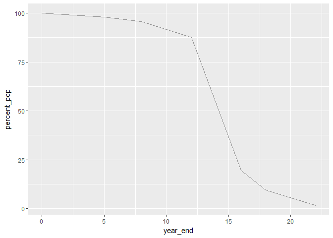
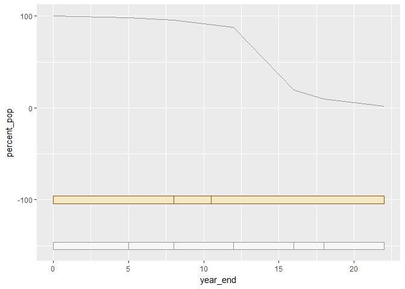
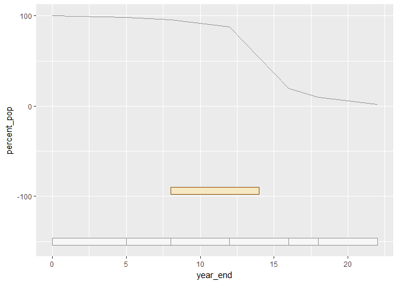
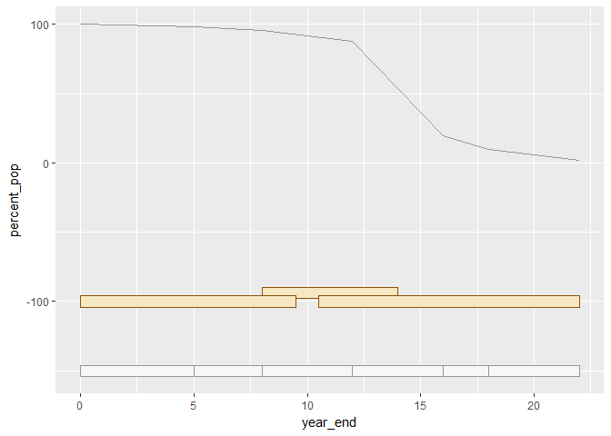
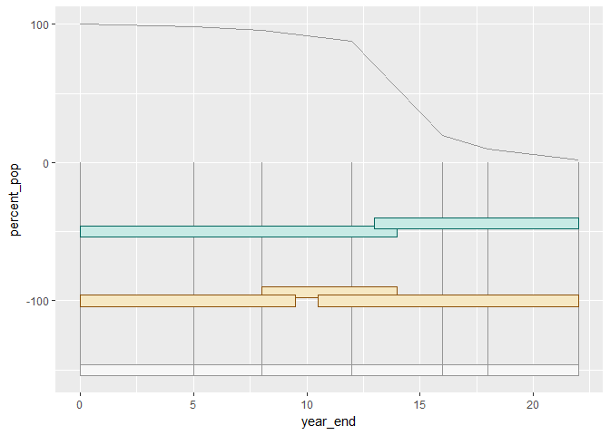
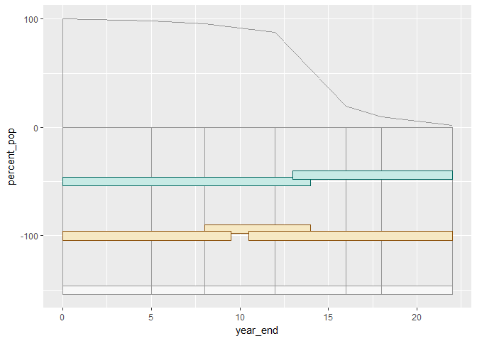
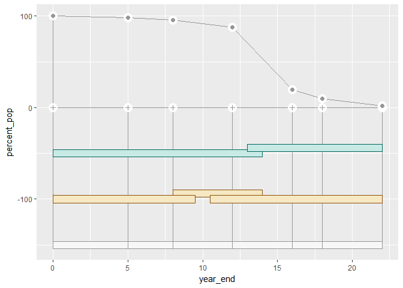
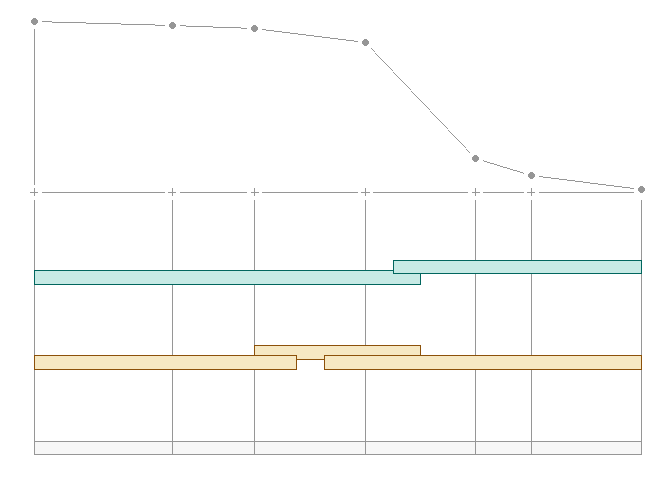
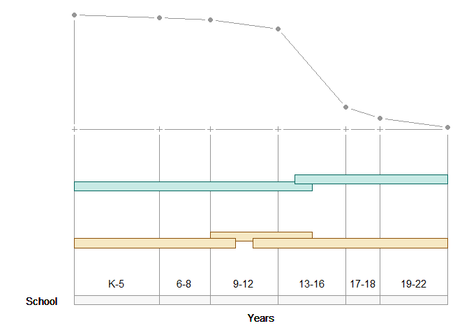

graphical improvisation
================

-   [preparation](#preparation)
-   [data](#data)
-   [assigning constants](#assigning-constants)
-   [start with the line graph](#start-with-the-line-graph)
-   [school rectangles](#school-rectangles)
-   [curriculum model rectangles](#curriculum-model-rectangles)
-   [development rectangles](#development-rectangles)
-   [adding the frills](#adding-the-frills)

The type of graphical improvisation I'll illustrate here can be described as drafting graphical primitives (points, lines, rectangles, text, etc.) on a Cartesian grid that is invisible to the viewer.

To start, one lays out the design on paper and assigns coordinates to key features of the graphical primitives, e.g., the four corners of a rectangle (*x*<sub>*m**i**n*</sub>, *x*<sub>*m**a**x*</sub>, *y*<sub>*m**i**n*</sub>, *y*<sub>*m**a**x*</sub>).

preparation
-----------

Always start your work session by launching the .Rproj file you created for this course. Using an R Project automatically sets the working directory to your course folder, making relative file paths easy to use.

-   File → Recent projects → me447\_visualizing-data.Rproj
-   Open a new R script called *tut29\_improvise.R*
-   Save it to your *practiceR* folder

In the R script, type your usual header

    #  ------------------------------------------
    #  graphical improvisation
    #
    #  name
    #  date
    #  ------------------------------------------

and add the usual knitr code chunk

    library(knitr)
    opts_knit$set(root.dir = "../")
    opts_chunk$set(echo = TRUE, messages = FALSE)

data
----

I laid out the starting and ending points of the rectangles in a spreadsheet.

``` r
library(tidyverse)
library(readxl)

df0 <- read_excel('data/improvise_data.xlsx')

kable(df0)
```

| model\_type | label1      | label2           |  year\_start|  year\_end|  percent\_pop|
|:------------|:------------|:-----------------|------------:|----------:|-------------:|
| school      | elementary  | K-5              |          0.0|        5.0|          97.9|
| school      | middle      | 6-8              |          5.0|        8.0|          95.8|
| school      | high        | 9-12             |          8.0|       12.0|          87.6|
| school      | undergrad   | 13-16            |         12.0|       16.0|          19.5|
| school      | master      | 17-18            |         16.0|       18.0|           9.5|
| school      | doctorate   | 19-22            |         18.0|       22.0|           1.6|
| curriculum  | commom      | NA               |          0.0|        9.5|            NA|
| curriculum  | vocational  | NA               |          8.0|       14.0|            NA|
| curriculum  | specialized | NA               |         10.5|       22.0|            NA|
| development | piaget      | Piaget's         |          0.0|       14.0|            NA|
| development | magolda     | Baxter/Magolda's |         13.0|       22.0|            NA|

assigning constants
-------------------

Here, I'll assign some variables that I might edit manually as well as some colors.

``` r
# y-height of the rectangles
bar_height <- 8 

# y-coord of the midpoint of the rectangles
rect_base  <- c(-150, -100, -94, -50, -44)

# color assignments
library(RColorBrewer)

# brown/blue-green
BrBG <- brewer.pal(6, "BrBG")
darkBr  <- BrBG[1]
medBr   <- BrBG[2]
lightBr <- BrBG[3]
lightBG <- BrBG[4]
medBG   <- BrBG[5] 
darkBG  <- BrBG[6]

# grays
Grays <- brewer.pal(6, "Greys")
gray1 <- Grays[1]
gray2 <- Grays[2]
gray3 <- Grays[3]
gray4 <- Grays[4]
gray5 <- Grays[5] 
gray6 <- Grays[6]
```

start with the line graph
-------------------------

``` r
# subset for the two columns of the line graph 
df_school <- df0 %>%
    filter(model_type == 'school')

# select just the two columns we need
df_line <- df_school %>% 
    select(year_end, percent_pop)

# add the missing 100% at year 0
m <- nrow(df_line)
df_line[m + 1, ] <- c(0.0, 100.0)
df_line <- arrange(df_line, year_end)

# line graph
f1 <- ggplot() +
    geom_line(data = df_line, aes(x = year_end, y = percent_pop), color = gray4)

f1
```



school rectangles
-----------------

I selected the *y* = −150 by trial and error.

``` r
# we have the school subset from earlier
f2 <- f1 + geom_rect(data = df_school
    , aes(xmin = year_start
        , xmax = year_end
        , ymin = rect_base[1] - bar_height/2
        , ymax = rect_base[1] + bar_height/2
        )
    , color = gray4, fill = gray1
    )

f2
```


curriculum model rectangles
---------------------------

``` r
# subset the data for the schools  
df_curric <- df0 %>% 
    filter(model_type == 'curriculum')

f3 <- f2 + geom_rect(data = df_curric
    , aes(xmin = year_start
        , xmax = year_end
        , ymin = rect_base[2] - bar_height/2
        , ymax = rect_base[2] + bar_height/2
        )
    , color = darkBr, fill = lightBr
    ) 

f3
```



This doesn't work quite because the middle curriculum bar overlaps the first and third.

I'll have to separate the `vocational` chunk from the other two.

``` r
df_curric_1  <- df_curric %>%
    filter(label1 == 'vocational')

f4 <- f2 + geom_rect(data = df_curric_1
    , aes(xmin = year_start
        , xmax = year_end
        , ymin = rect_base[3] - bar_height/2
        , ymax = rect_base[3] + bar_height/2
        )
    , color = darkBr, fill = lightBr
    ) 
    
f4
```



Now place the remainder of the row on top of the `vocational` bar.

``` r
df_curric_2  <- df_curric %>%
    filter(label1 != 'vocational')

f4 <- f4 + geom_rect(data = df_curric_2
    , aes(xmin = year_start
        , xmax = year_end
        , ymin = rect_base[2] - bar_height/2
        , ymax = rect_base[2] + bar_height/2
        )
    , color = darkBr, fill = lightBr
    ) 
    
f4
```



development rectangles
----------------------

``` r
df_develop1  <- df0 %>%
    filter(label1 == 'magolda')
df_develop2  <- df0 %>%
    filter(label1 == 'piaget')

f5 <- f4 + geom_rect(data = df_develop2
    , aes(xmin = year_start
        , xmax = year_end
        , ymin = rect_base[4] - bar_height/2
        , ymax = rect_base[4] + bar_height/2
        )
    , color = darkBG, fill = lightBG
    ) + geom_rect(data = df_develop1
    , aes(xmin = year_start
        , xmax = year_end
        , ymin = rect_base[5] - bar_height/2
        , ymax = rect_base[5] + bar_height/2
        )
    , color = darkBG, fill = lightBG
    ) 
    
f5
```


adding the frills
-----------------

The first item to add are vertical helper lines at the divisions between school types: elementary, middle, high school, etc.

``` r
df_grid <- df_line %>% 
    select(year_end)

f6 <- f5 + geom_segment(data = df_grid, 
    aes(x = year_end, xend = year_end, y = -150, yend = 0)
    , color = gray4)

f6
```


Oops. These lines are drawn as a layer on top of our data graphics. We would prefer that they be under the rectangles. So we have to start over and rearrange the order in which we add layers.

I'll draw the helper lines before drawing the rectangles.

``` r
f7 <- ggplot() +
    geom_line(data = df_line 
    , aes(x = year_end, y = percent_pop), color = gray4) + 
    geom_segment(data = df_grid 
    , aes(x = year_end, xend = year_end, y = -150, yend = 0)
    , color = gray4) +
    geom_rect(data = df_school
    , aes(xmin = year_start
        , xmax = year_end
        , ymin = rect_base[1] - bar_height/2
        , ymax = rect_base[1] + bar_height/2
        )
    , color = gray4, fill = gray1
    ) + 
    geom_rect(data = df_curric_1
    , aes(xmin = year_start
        , xmax = year_end
        , ymin = rect_base[3] - bar_height/2
        , ymax = rect_base[3] + bar_height/2
        )
    , color = darkBr, fill = lightBr
    ) + 
    geom_rect(data = df_curric_2
    , aes(xmin = year_start
        , xmax = year_end
        , ymin = rect_base[2] - bar_height/2
        , ymax = rect_base[2] + bar_height/2
        )
    , color = darkBr, fill = lightBr
    ) + 
    geom_rect(data = df_develop2
    , aes(xmin = year_start
        , xmax = year_end
        , ymin = rect_base[4] - bar_height/2
        , ymax = rect_base[4] + bar_height/2
        )
    , color = darkBG, fill = lightBG
    ) + 
    geom_rect(data = df_develop1
    , aes(xmin = year_start
        , xmax = year_end
        , ymin = rect_base[5] - bar_height/2
        , ymax = rect_base[5] + bar_height/2
        )
    , color = darkBG, fill = lightBG
    ) 

f7
```



I added a base line for the scatterplot at y = 0. In addition, i want6 the axis line at x = 0 to extend up to the 100% point. I'll add the following code chunk in the `f7` code above just after the segment chunk.

      +
        geom_segment(data = df_grid 
        , aes(x = year_end[1], xend = year_end[m + 1]
          , y = 0, yend = 0)
        , color = gray4) +
        geom_segment(data = df_grid 
        , aes(x = year_end[1], xend = year_end[1]
          , y = 0, yend = 100)
        , color = gray4) +



In the next chunk I'm adding a white filled circle data marker along the baseline and overprint them with a small plus sign.

      +
        geom_point(data = df_grid
          , aes(x = year_end, y = 0)
          , color = 'white', size = 5) +
        geom_point(data = df_grid
          , aes(x = year_end, y = 0)
          , color = gray4, size = 1.5, shape = 3) +


Similarly, on the line graph, I'll add a large white data marker followed by a smaller gray data marker.

``` r
f8 <- f7 +
    geom_point(data = df_line
    , aes(x = year_end, y = percent_pop)
    , color = 'white', size = 5) +
    geom_point(data = df_line
    , aes(x = year_end, y = percent_pop)
    , color = gray4, size = 2, shape = 21, fill = gray4)

f8
```



In the last few steps, I want to remove all the default markings.

``` r
f9 <- f8 +
    theme_void()

f9
```



Next I add text labels for the bottom row of rectangles.

``` r
f10 <- f9 +
    geom_text(aes(x = 11, y = -165, label = 'Years')) +
    geom_text(aes(x = (year_start + year_end)/2
        , y = -135, label = label2)) +
    geom_text(aes(x = -1, y = -150, label = 'School', hjust = 'right')) +
    scale_x_continuous(limits = c(-3, 22))


f10
```



And so it goes. The rest of the code is similar. You continue to build up layer on layer of primitive graphical elements.

<!-- ## bibliography  -->
<!-- <div id="refs"></div> -->

------------------------------------------------------------------------

[main page](../README.md)<br> [topics page](../README-by-topic.md)
